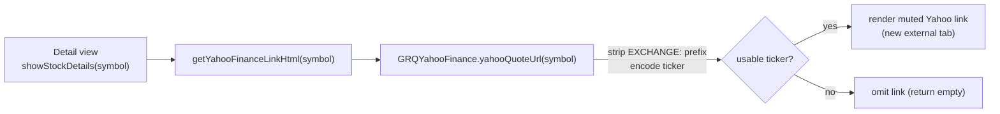

# Add a Yahoo Finance link on the stock details view (opens externally)

## Summary

Adds a small, understated **Yahoo Finance** link as the lowest-priority item at
the very bottom of the single-stock detail view (the `?stock=<symbol>` view
rendered by `showStockDetails` in `docs/app.js`). It is a "here are our numbers;
if a figure looks off, confirm it at the source" aid — it opens the stock's
Yahoo quote page in a **new standalone external tab** (`target="_blank"` +
`rel="noopener noreferrer"`), so it works when launched from the installed PWA.

Symbols are stored `EXCHANGE:TICKER` (e.g. `NASDAQ:UCTT`), so the URL drops the
exchange prefix and uses the bare ticker:
`NASDAQ:UCTT` → `https://au.finance.yahoo.com/quote/UCTT/` (the AU Yahoo domain,
matching the issue's example).

The prefix-stripping and URL building live in a new, DOM-free, unit-tested
helper module `docs/yahoo_finance.js` (`GRQYahooFinance.yahooQuoteUrl`), loaded
as a classic `<script>` before `app.js` — mirroring `docs/stock_selection.js`.
The helper returns `null` for an unusable symbol so the detail view omits the
link rather than rendering a broken one. Both the URL and symbol are
HTML-escaped before interpolation (defence in depth, issue #63 precedent), and
the ticker is percent-encoded as a single path segment.

Closes #570.

## Evidence

Playwright MCP and a Chromium binary were **unavailable** in this run, so a live
browser screenshot could not be captured (per the Error Recovery guidance, the
behaviour is documented and verified via tests instead).

The exact URLs produced by the shipped helper (run under Deno against
`docs/yahoo_finance.js`):

```text
NASDAQ:UCTT => https://au.finance.yahoo.com/quote/UCTT/
NYSE:RBC    => https://au.finance.yahoo.com/quote/RBC/
NASDAQ:     => null   (no ticker → link omitted)
```

The link markup appended to the bottom of the detail card
(`getYahooFinanceLinkHtml`):

```html
<div class="row mt-3">
  <div class="col-12 text-center yahoo-finance-link">
    <a href="https://au.finance.yahoo.com/quote/UCTT/" target="_blank"
       rel="noopener noreferrer"
       title="Confirm NASDAQ:UCTT on Yahoo Finance (opens in a new tab)">
      <i class="fas fa-external-link-alt"></i> Yahoo Finance
    </a>
  </div>
</div>
```

It is styled small and muted (`font-size: 0.75rem`, theme-aware
`--grq-text-muted` colour meeting WCAG 2 AA in both themes) so it never competes
with the figures above it.

### Flow



## Test Plan

- Added `tests/yahoo_finance_link_test.ts` covering the shipped
  `GRQYahooFinance` helpers:
  - `tickerFromSymbol` drops the `EXCHANGE:` prefix, accepts a bare ticker, and
    trims whitespace.
  - `tickerFromSymbol` returns `null` for empty / whitespace / trailing-colon /
    non-string input (error + edge paths).
  - `yahooQuoteUrl` builds the exact AU Yahoo quote URL from the bare ticker
    (matches the issue example).
  - `yahooQuoteUrl` returns `null` when no ticker can be derived.
  - `yahooQuoteUrl` percent-encodes an unusual ticker so the URL stays safe.
- Full Deno suite passes (`deno test --allow-read tests/*.ts`): 1110 passed.
- `./quality.sh` run clean (Rust fmt/clippy/check/test + Deno fmt/lint/check/test).

## Files changed

- `docs/yahoo_finance.js` — new DOM-free helper module (`GRQYahooFinance`).
- `docs/app.js` — `getYahooFinanceLinkHtml` + render call at the bottom of the
  detail card.
- `docs/index.html` — load `yahoo_finance.js` before `app.js`.
- `docs/styles.css` — understated, theme-aware `.yahoo-finance-link` styling.
- `tests/yahoo_finance_link_test.ts` — new behavioural tests.
- `README.md` — document the new link.
- `Cargo.lock` — routine minor dependency bumps from `quality.sh`'s
  `cargo update` (all tests pass).
