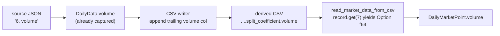

# Extract daily volume into the market-data CSV (trailing volume column)

## Summary

The low-volume guard (sub-issue of #563) needs per-day trading **volume**, but
the derived market-data CSVs carried only
`date,ticker,high,low,open,close,split_coefficient` — volume was deserialised
from the source JSON and then dropped before the CSV was written. This change
carries daily volume through extraction into the derived CSV as a new
**trailing** column, and exposes it on the parsed point.

`Closes #575`

### What changed

- **`src/models.rs`** — added `volume: Option<f64>` to `DailyMarketPoint`. The
  raw Alpha Vantage point struct (`DailyData`) already captured
  `#[serde(rename = "6. volume")]`, so no source-side change was needed.
- **`src/utils.rs` (writers)** — appended `volume` as the **last** column in
  both the header writer and the row writer. The header is now
  `date,ticker,high,low,open,close,split_coefficient,volume`.
- **`src/utils.rs` (`read_market_data_from_csv`)** — reads volume from
  `record.get(7)`; missing (older 7-column CSVs), blank or non-numeric values
  all yield `None`, exactly mirroring how `split_coefficient` (col 6) is
  handled today.

No existing positional index changed (date=0, ticker=1, high=2, low=3, open=4,
close=5, split_coefficient=6); volume is appended at index 7, so every existing
parse and all historical CSVs stay valid. Historical CSVs are **not**
bulk-rewritten — the column is added going forward on re-extraction.

### Data flow



## Evidence

Backend/CLI change only — no web interface to screenshot. Verified via unit
tests calling the real reader with both CSV shapes:

- `test_read_market_data_from_csv_reads_trailing_volume_column` — 8-column CSV:
  a numeric volume parses to `Some(123456.0)`; blank and non-numeric values both
  fall back to `None`.
- `test_read_market_data_from_csv_legacy_7_column_has_no_volume` — legacy
  7-column CSV still parses, with volume `None` on every row and existing
  positional fields (split_coefficient, closes) intact.

Both pass, and the existing split-reconciliation tests are unaffected:

```text
test utils::tests::test_read_market_data_from_csv_reads_trailing_volume_column ... ok
test utils::tests::test_read_market_data_from_csv_legacy_7_column_has_no_volume ... ok
test utils::tests::test_read_market_data_from_csv_skips_unparseable_close ... ok
test result: ok. 78 passed; 1 failed; ...
```

`cargo fmt --check` and `cargo clippy --all-targets`/`--tests` (with
`-D warnings -D clippy::uninlined_format_args`) are clean.

### Pre-existing, environment-only failures (not introduced here)

Two tests fail **only** because this worker's checkout of the external
market-data repository is a bare `.git` clone with no `data/`
directory: `utils::tests::test_read_market_data` and
`tests/market_data_tests.rs::test_create_market_data_long_csv_for_first_score_file`.
Both were confirmed to fail identically on the base branch before any change,
so they are pre-existing environment issues, not regressions.

## Test Plan

- Added `src/utils.rs::tests::test_read_market_data_from_csv_reads_trailing_volume_column`.
- Added `src/utils.rs::tests::test_read_market_data_from_csv_legacy_7_column_has_no_volume`.
- Updated the `split_series` test helper to set `volume: None` for the new field.
- Ran `cargo test --lib` (78 passed, the 1 failure is the pre-existing
  environment-only `test_read_market_data`), `cargo fmt --check`, and
  `cargo clippy` — all clean.
