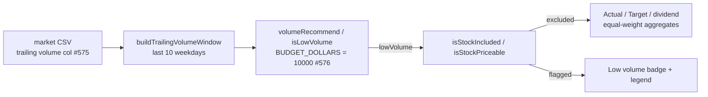

# [#577] Flag and exclude low-volume stocks from the dashboard portfolio and aggregations

## Summary

Low-volume (illiquid) names are now **flagged** and **excluded** from the
dashboard portfolio and from **every** aggregate (equal-weight) figure —
notably the "Actual (After 90 Days)" line — so a name too thin to trade neither
helps nor hurts the Actual/Target lines. Flagged names stay **visible** via a
"Low volume" badge and a legend, rather than vanishing silently. **Closes #577.**

The liquidity decision reuses GRQ training's `volumeRecommend` definition as a
single source of truth (the #576 helper, added here since it was an unmet
dependency): over a trailing 10-weekday window, the average daily **dollar**
volume (`volume × low price`) below the `BUDGET_DOLLARS = 10000` trade budget
flags the stock. Per #576's units caveat, the dashboard CSVs store prices in
**dollars**, so dollar volume is computed directly (no `/100`).

When volume is **unknown** (older pre-volume-column CSVs — currently every
committed CSV, since #575 only added the column), the name is **not** flagged
("insufficient data ⇒ not flagged"), so historical dates are never
mass-excluded. The effect today is therefore a no-op on live data; the wiring
activates automatically once 8-column CSVs carry volume.

### What changed

- **`docs/volume_recommend.js` (new)** — the #576 single-source-of-truth helper:
  `BUDGET_DOLLARS`, `volumeRecommend(window)`, `isLowVolume(window)` and
  `buildTrailingVolumeWindow(series, asOfDate)`. Pure, published on
  `globalThis.GRQVolume`, loaded as a classic `<script>` and imported by tests.
- **`docs/projection.js`** — `isStockIncluded` gains a 4th `lowVolume` parameter
  (defaults `false`); the three equal-weight aggregators
  (`calculateIncludedPortfolioPerformance`, `…DividendYield`,
  `calculatePortfolioTargetPercentage`) honour `stock.lowVolume`.
- **`docs/app.js`** — parses the trailing volume column, adds
  `isStockLowVolume(symbol, scoreDate)` over a trailing 10-weekday window, and
  routes it through the **single** `isStockPriceable` gate that feeds the chart
  Actual / "Actual (After 90 Days)" line, the totals row and the dividend
  figures. Renders a **Low volume** badge and tags the row `low-volume-stock`.
- **`docs/trend_predictions.js` / `docs/trend_series.js`** — the Trend view
  parses volume, resolves a `lowVolume` flag, and excludes flagged names from
  its Actual/Target/count aggregates.
- **`docs/index.html` / `docs/trend.html`** — load `volume_recommend.js` before
  consumers; index adds the legend. **`docs/styles.css`** styles the badge.
  **`docs/sw.js`** precaches the new asset.
- **`scripts/*.ts` + affected tests** — import the new helper so the diagnostic
  sweeps that call `resolvePredictionStocks` keep working.

### Data flow

## Evidence

This is a dashboard (UI + data-pipeline) change. **Playwright MCP was not
available in this environment**, so no live screenshot was captured. The
behaviour is instead pinned by behavioural Deno tests against the real shipped
kernels, and the UI surfaces are verified to be present in the committed markup:

- Badge rendered in `docs/app.js` (`low-volume-badge`), styled in
  `docs/styles.css`, legend in `docs/index.html`.
- Because no committed CSV yet carries volume, no badge renders on live data
  today (the documented "insufficient data ⇒ not flagged" rule); the
  synthetic-fixture tests below exercise the flagged path end-to-end.

### Test results

- `deno test --allow-read tests/*.ts` → **1136 passed, 0 failed**.
- `deno fmt` / `deno lint` / `deno check` → clean.
- `cargo check` / `cargo clippy` → clean (no Rust changed).

> **Pre-existing, unrelated failure:** `quality.sh`'s `cargo test` step fails on
> `utils::tests::test_read_market_data`, which reads the external
> `../GRQ-shareprices2026Q2` repo and needs a "SEM" symbol file that is absent
> in this environment. The failure reproduces identically with the parent
> commit's unmodified `src/utils.rs` — this change touches **no** Rust — so it is
> environmental and out of scope for #577.

## Test Plan

New tests:

- `tests/volume_recommend_test.ts` — the #576 helper: below-budget → `-1`;
  liquid → ~1; borderline → capped 0.5; unknown volume → `null` (not flagged);
  present-but-tiny vs unknown; non-numeric/zero cells skipped; trailing-window
  builder.
- `tests/low_volume_exclusion_test.ts` — `isStockIncluded` drops a low-volume
  name and defaults `lowVolume` to false; low-volume names excluded from the
  Actual, Target and dividend aggregates; **a known-illiquid synthetic fixture
  is flagged and removed while the liquid name is unaffected**; a
  pre-volume-column CSV flags nothing (no mass-exclusion).
- `tests/js_syntax_test.ts` — `docs/volume_recommend.js` parses cleanly.

Updated imports so existing suites/scripts load the new helper:
`tests/trend_predictions_test.ts`, `tests/dashboard_actual_horizon_basis_test.ts`,
and six `scripts/*_diagnostic*.ts` / `scripts/residual_gap_reconciliation.ts`.

## Acceptance criteria

- ✅ Low-volume names excluded from portfolio membership and from aggregate
  (equal-weight) computations (single `isStockIncluded` / `isStockPriceable`
  gate).
- ✅ Visible indicator (Low volume badge + legend).
- ✅ A known-illiquid synthetic fixture is removed from the aggregate; liquid
  names unaffected (`tests/low_volume_exclusion_test.ts`).
- ✅ Unknown volume ⇒ not flagged — no accidental mass-exclusion of historical
  dates.
