## Summary

Verification-first sub-issue of #563: **confirm** the GRQ training
`volumeRecommend` liquidity guard down-ranks low-volume names, and tune **only
if** it is not biting. Investigation shows the guard is applied on the single
training-label path and is biting correctly, with correct cents→dollars units,
so **no tuning is warranted and no production code is changed**. The written
confirmation (the issue's acceptance criterion) is recorded in
`docs/archive/investigations/issue-579-volumerecommend-training-guard.md`.
Closes #579.

Key findings (full citations in the investigation doc):

- **Applied on all paths** — `GRQ/src/LearnUtil.ts:217` (`output: [recommend]`)
  is the *only* training-output producer, and `recommend` is always the capped
  `Math.max(Math.min(core.volumeRecommend, priceRecommend, 1), -1)`
  (`LearnUtil.ts:154-157`). `volumeRecommend` enters via `Math.min`, so it can
  only lower a score; at `-1` it pins the output to `-1`. No bypass exists.
- **Biting** — driving the real GRQ `profitRecommend`/`BUDGET_DOLLARS` exports,
  every name below `$10,000`/day average dollar volume is forced to a `-1`
  training score even against a maximal BUY price signal (`priceRecommend =
  0.9931`); above the budget the score ramps up from 0.
- **Units correct** — GRQ stores prices in cents (`Market.ts:494`,
  `MarketStockInfo.ts:325`), so `averagePV / 100` in `CoreFeatures.ts:239`
  yields dollars, directly comparable to `BUDGET_DOLLARS = 10000`.

This matches the established doc-only verification pattern for the #563/#544
family (`docs/archive/investigations/issue-552..557-*.md`): the measurement is
tracked in GRQ-validation while the guard lives upstream in GRQ. No GRQ PR is
needed because no tuning is required.

## Evidence

Backend/analysis change with no web interface — no screenshot applicable.

Empirical confirmation, produced by importing the **real** GRQ
`profitRecommend` and `BUDGET_DOLLARS` exports and sweeping average daily dollar
volume (price fixed at $1.00/share; strong BUY price signal
`priceRecommend(+10%) = 0.9931`):

| Avg daily $ volume | `volumeRecommend` | Final training score | Outcome |
| ---: | ---: | ---: | --- |
| $9,999 | −1.0000 | **−1.0000** | suppressed |
| $10,000 | 0.0000 | 0.0000 | at threshold |
| $10,001 | 0.0001 | 0.0001 | passes |
| $50,000 | 0.5000 | 0.5000 | passes |
| $5,000,000 | 0.9980 | 0.9931 | passes (price-limited) |

```mermaid
flowchart LR
    A[avg daily $ volume] --> B{&lt; $10,000/day?}
    B -- yes --> C[volumeRecommend = -1]
    B -- no --> D[volumeRecommend ramps 0→1]
    C --> E[recommend = max&#40;min&#40;volumeRecommend, priceRecommend, 1&#41;, -1&#41;]
    D --> E
    E --> F[output forced to -1 when volumeRecommend = -1]
```

## Test Plan

No code changed, so no automated tests are added (consistent with the doc-only
verification siblings issue-552 through issue-557). The empirical evidence above was generated by
running the real upstream GRQ exports; `markdownlint-cli2` passes on the new
documentation (0 errors).
