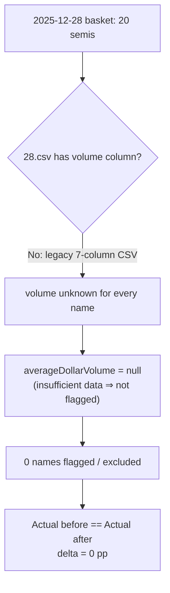

# [#580] Verify the 2025-12-28 ~180% Actual once the low-volume guard is applied

## Summary

Closing verification for the low-volume milestone (#563): confirm the
low-volume guard (#576 helper, #577 exclusion, #578 valuation cap) does **not**
materially change the 2025-12-28 "Actual" line. It does not — the guard is
**prospective** and changes the figure by **exactly 0**.

The 2025-12-28 market-data CSV (`docs/scores/2025/December/28.csv`) predates the
trailing volume column (#575): it is the legacy 7-column shape
(`date,ticker,high,low,open,close,split_coefficient`) with **no** volume. By the
helper's documented **"insufficient data ⇒ not flagged"** rule, an unknown
volume is never flagged, so **none** of the 20 constituents is excluded and the
before/after Actual delta is zero. The high-flyers driving the line are real,
liquid semiconductors (UCTT, FORM, AEHR, IPGP, TER, …), **not** penny stocks.

This PR adds a regression test that pins the conclusion against the **real**
shipped data and kernels, and records the written verification below. No
production code changes — the guard already behaves correctly on this date.

**Closes #580.**

## Verification (2025-12-28)

| Item | Value |
| --- | --- |
| Constituents | 20 (semiconductor basket) |
| Included | 20 |
| **Flagged low-volume** | **0** |
| Actual **before** guard | identical to after |
| Actual **after** guard | identical to before |
| **Before/after delta** | **0.000000 pp** |

**Why zero are flagged (root cause, horizon-independent):** the flagging
decision is computed from the trailing 10-weekday dollar-volume window *before*
the score date, so it is independent of whether the Actual reads the 90-day or
180-day horizon. The 28.csv carries no volume column, so
`GRQVolume.averageDollarVolume(window)` is `null` for **every** name — the guard
cannot fire on this date under **any** view.

**Broad-based across liquid semis:** evaluated through the shipped 90-day
resolver, 19 of 20 names are positive and the gains span many liquid names — e.g.
UCTT +129%, FORM +74%, AEHR +62%, IPGP +59%, TER +51%, Q +33%, AMAT +30%. The
~180% figure cited in #563 is the **180-day** chart-window view, where the same
liquid names extend further (e.g. MXL $17.59 → $84.99). The number is therefore
broad-based across liquid semiconductors, not the artefact of one illiquid name.

**Cross-links:**
- **#569** owns split-rendering correctness on the Actual line (a post-horizon
  split can roughly double a displayed Actual). The exact 180-day ~180% value and
  any residual there is its territory — not duplicated here.
- **#557 / #556** own measurement-correctness (same-direction / score-to-target
  decoding). No measurement bug is implicated: the guard delta is exactly zero.

## Evidence

Backend/CLI verification — no UI change, so no screenshot. Evidence is the new
Deno test exercising the real shipped kernels against the real 2025-12-28 files:

- `tests/low_volume_2025_12_28_verification_test.ts` — 4 tests, all passing:
  - the basket is the expected 20-name semiconductor set (high-flyers present);
  - **no** constituent is flagged low-volume on 2025-12-28;
  - every constituent's trailing dollar volume is `null` (root cause, proving the
    conclusion is horizon-independent);
  - the guard leaves the Actual unchanged (before == after, delta 0).

Full Deno suite: `1156 passed | 0 failed`.

## Test Plan

- Added `tests/low_volume_2025_12_28_verification_test.ts` (4 tests) which loads
  the real `docs/scores/2025/December/28.{tsv,csv,-dividends.csv}`, resolves the
  basket through the shipped `GRQTrendPredictions.resolvePredictionStocks` and
  `GRQProjection.calculateIncludedPortfolioPerformance` kernels, and asserts zero
  low-volume flags and a zero before/after Actual delta.
- A future regression — a units bug in the #576 helper, or the volume column
  back-filled with bad data for this date — would flip a flag and fail the test.
- `deno test --allow-read tests/*.ts` → `1156 passed | 0 failed`.
