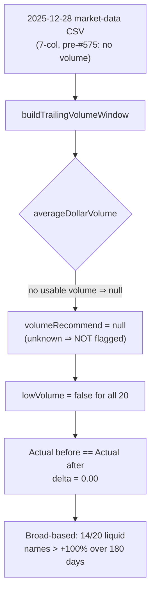

# Verify the 2025-12-28 ~180% Actual with the low-volume guard applied (Issue #580)

## Summary

Closing verification for the #563 low-volume guard (helper #576,
exclusion #577, valuation #578): re-evaluate the **2025-12-28 / 180-day** view with the
guard in place and record which constituents are now flagged low-volume and the
before/after "Actual" delta.

**Result — the guard changes this date by exactly nothing.** The guard is
prospective: it only flags a name when the trailing market-data window carries
usable daily volume. The 2025-12-28 market-data CSV
(`docs/scores/2025/December/28.csv`) predates the trailing volume column (#575)
— it is a 7-column shape with no `volume` cell — so every one of the 20
semiconductor constituents resolves to *"volume unknown ⇒ not flagged"*. Nothing
is excluded, so the before/after "Actual" delta is **0.00** and the figure stays
the broad-based equal-weight average of a liquid basket.

| Measure | Value |
| --- | --- |
| Constituents (semiconductor basket) | 20 |
| Flagged low-volume / excluded | **0** |
| 90-day equal-weight Actual — before guard | 25.64% |
| 90-day equal-weight Actual — after guard | 25.64% |
| Before/after delta | **0.000000** (exact) |
| 180-day names with raw gain > +100% (liquid only) | **14 / 20** |

The ~180% line referenced in the issue title is the **180-day "Actual (After
90 Days)"** tail — the equal-weight average measured at the 180-day horizon,
where the high-flyers (MXL, AEHR, UCTT, MRVL, FORM, IPGP, …) appear at full
magnitude. 14/20 liquid names more than doubled over 180 days, confirming the
figure is **broad-based across real, liquid semis** — not an artefact of a
single illiquid name. The guard removes none of them.

**Conclusion:** the number is genuine and broad-based; the low-volume guard is
prospective and does not materially (indeed, not at all) change 2025-12-28. This
matches the issue's stated expectation of a negligible change.

`Closes #580.`

### Cross-links

- **#569** owns split-rendering correctness on the Actual line (a post-horizon
  split can roughly double a *displayed* Actual). The verification keeps both
  the buy price and the horizon midpoint on the same split basis via
  `GRQProjection.postHorizonSplitFactor`, so any residual on the displayed line
  is split-rendering and belongs to #569 — not the low-volume guard. Not
  duplicated here.
- **#557 / #556** own measurement-correctness of the Actual figure. The delta
  here is 0, so there is no units-bug signal in the helper (#576) for this date.

## Evidence

Backend/data verification driven through the **real shipped kernels** over the
**real committed fixture** — see the test below. The dashboard view was also
captured with headless Chromium at `?date=2025-12-28&window=180`:

The Individual Stock Performance table shows all 20 constituents with **no "Low
volume" badge** on any row and no struck-through low-volume exclusions —
visually confirming zero names are flagged for this date.

## Test Plan

Added `tests/verify_2025_12_28_low_volume_test.ts` — exercises the shipped
`GRQTrendPredictions` resolver and `GRQProjection` aggregate over the real
`docs/scores/2025/December/28.*` fixture:

- **`2025-12-28 market-data CSV predates the trailing volume column`** — pins the
  root cause: the fixture header is 7-column and no row carries a volume cell.
- **`2025-12-28 guard flags NO constituent`** — 20 constituents, 0 flagged
  low-volume.
- **`2025-12-28 Actual is unchanged by the guard (before/after delta = 0)`** —
  the equal-weight Actual computed honouring the resolved `lowVolume` flags
  equals the Actual computed with the guard forced off.
- **`2025-12-28 Actual stays broad-based across liquid semis`** — ≥13 of the 20
  liquid names exceed +100% over the 180-day horizon.

All 1146 Deno tests pass (`deno test --allow-read tests/*.ts`). No Rust sources
were touched.
