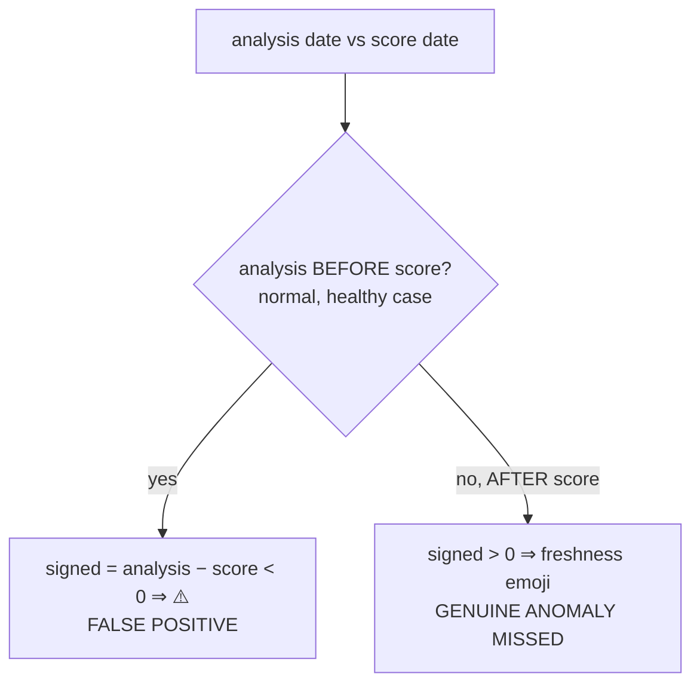

## Summary

Diagnose-only root-cause analysis of the fair-value freshness ⚠️ indicator
(issue #547, `getFreshnessIndicator()` in `docs/app.js`), worked from the
DD/2025-12-28 example. **No dashboard behaviour is changed** — the fix is a
separate, later issue. Closes #587.

**Finding.** The ⚠️ is a **false positive** driven by an **inverted sign** in
`signedDaysFromScore`:

- Shipped: `signedDaysFromScore = floor(analysisDate − scoreDate)`, and the
  guard fires ⚠️ when this is `< 0` — i.e. when the analysis is dated *earlier*
  than the score date.
- A fair-value analysis is, in the normal case, **published before** the score
  that consumes it, so `analysisDate − scoreDate` is normally **negative** for
  healthy data — tripping the ⚠️ guard almost universally.
- The emoji scale (`0–1 🌹 … 14+ 🕸`) uses **positive** thresholds, so the age
  it expects is the **opposite sign**, `floor(scoreDate − analysisDate)`. The
  inline comment ("negative when the analysis is dated *after* the score date —
  an invariant the pipeline must never violate") describes that intended
  invariant; the arithmetic implements its negation.
- For DD/2025-12-28: analysis dated **23 Dec 2025**, score date **28 Dec 2025** →
  `signedDaysFromScore = −5` → ⚠️. The intended age is **+5** days → would show
  **🥀**. So DD is a **false positive**, not a mis-dated row.
- Dual failure mode: a genuine after-score analysis yields a *positive* signed
  age → a freshness emoji, so the indicator is **silent on exactly the anomaly
  it was built to catch**.

**Blast radius (systemic).** Running the diagnostic over the committed dataset
(`deno run --allow-read scripts/diagnose_freshness_indicator.ts`):

| Metric | Value |
| --- | ---: |
| Score dates scanned | 291 |
| Rated rows in the 30-day window | 67,934 |
| Rows rendering ⚠️ | **67,709 (99.7%)** — all false positives |
| Genuine anomalies among ⚠️ rows | 0 |
| After-score anomalies missed | 0 |
| Score dates with ≥1 ⚠️ | 291 (all) |
| ⚠️ rows on 2025-12-28 alone | 231 (incl. DD) |

Full written analysis: `docs/fixes/freshness-indicator-sign-investigation.md`.

## Evidence

Backend/CLI diagnostic — no UI change in this PR, so no screenshot. Evidence is
the diagnostic CLI output and the unit tests below.

```text
# Fair-value freshness ⚠️ diagnostic — issue #587
Score dates scanned:        291
Rated rows in 30-day window: 67934
Rows showing ⚠️ (total):     67709
  · false positives:         67709
  · real anomalies:          0
Genuine anomalies MISSED:    0
## Worked example — DD / 2025-12-28
  analysis dated 2025-12-23; signedDaysFromScore=-5 (shipped ⇒ ⚠️); intended age=5 days ⇒ false-positive.
```



## Test Plan

New `tests/freshness_indicator_diagnostic_test.ts` (15 cases) calls the real
diagnostic functions with known data:

- `signedDaysFromScore` / `intendedAnalysisAgeDays` opposite-sign behaviour.
- `parseAnalysisDate`, `parseCSVLine`, `computeAvgStars` happy/edge paths.
- `analyseDataset` flags DD/2025-12-28 as a false positive; same-day shows no
  ⚠️; after-score anomaly is *missed* (not flagged); unrated and out-of-window
  rows excluded; missing CSV skipped; false positives dominate a realistic batch.

Run: `deno test --allow-read tests/freshness_indicator_diagnostic_test.ts` →
15 passed. Full suite: 1136 passed / 0 failed. `deno fmt`/`lint`/`check` and
markdownlint all clean.

## Files

- `scripts/freshness_indicator_diagnostic.ts` — core diagnostic module (pure,
  testable).
- `scripts/diagnose_freshness_indicator.ts` — read-only CLI report.
- `tests/freshness_indicator_diagnostic_test.ts` — unit tests.
- `docs/fixes/freshness-indicator-sign-investigation.md` — written root-cause
  analysis.
- `README.md` — lists the two new diagnostic scripts.
