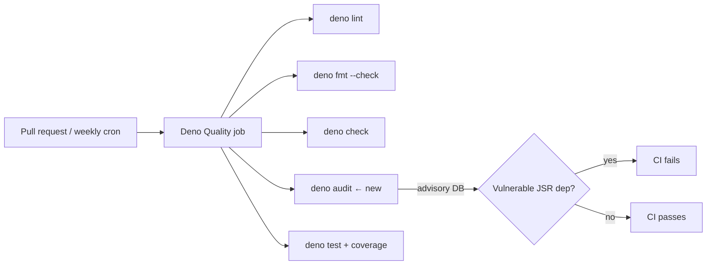

# SCR-VULN-SCAN: Add Deno/JSR vulnerability scanning to CI

## Summary

The Rust dependency surface was audited in CI (`cargo audit`), but the
Deno/JSR surface (`@std/assert`, `@std/yaml`, `@std/jsonc`) had no
vulnerability scanner — a compromised JSR/`@std` release would pass
through CI undetected. This wires `deno audit` into the existing
**Deno Quality** workflow so the resolved JSR dependency graph is checked
against the advisory database, mirroring `cargo audit` on the Rust side.

Changes:

- `.github/workflows/deno-quality.yml` — added a `Deno audit` step
  (`deno audit`) after the type-check step, and added a weekly `schedule`
  trigger (`cron: "0 6 * * 1"`, matching `cargo-audit.yml`) so a JSR
  compromise is caught even when no pull request is open.
- `README.md` — documented the new `deno audit` step and weekly schedule
  under the Deno Quality workflow entry.
- `tests/deno_quality_workflow_test.ts` — added regression tests.

Closes #59.

## Evidence

This is a CI/workflow change with no web interface to screenshot.
Verification was done via the test suite and by confirming `deno audit`
runs cleanly against the current lockfile:

```text
$ deno audit
No known vulnerabilities found
```



## Test Plan

Added to `tests/deno_quality_workflow_test.ts` (both fail against the
unmodified workflow, pass after the change):

- `Deno Quality workflow runs deno audit (SCR-VULN-SCAN, Issue #59)` —
  asserts the `quality` job runs `deno audit`.
- `Deno Quality workflow triggers on a weekly schedule (Issue #59)` —
  asserts the workflow declares a non-empty `schedule` cron trigger.

Existing Deno Quality workflow tests (file exists, valid YAML,
pull_request trigger, read-only permissions, lint/fmt/check/test steps,
SHA-pinned actions) continue to pass. Full Deno suite: `103 passed`.
