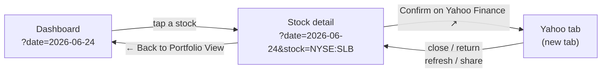

# Make the Yahoo Finance link obvious and return to my stock on close

## Summary

The single-stock detail card carries a bottom-of-card link to confirm our
numbers on Yahoo Finance. Two problems, both fixed here. **Closes #590.**

1. **The link did not read as a tappable pop-out.** It rendered as small muted
   grey text with no underline at rest, its `fas fa-external-link-alt` icon was
   blank (Font Awesome is not loaded in `index.html`), and the "opens in a new
   tab" cue lived only in a hover `title` that phones never display.
2. **Returning from the popped-out Yahoo tab landed on the aggregate
   dashboard**, not the stock you were viewing. `showStockDetails` never wrote
   `?stock=` to the URL, so a mobile tab discard / reload restored the date
   (via `?date=`, #517) but not the stock.

### What changed

- **Obvious link** (`docs/app.js`, `docs/styles.css`): the link now reads
  unmistakably as an external pop-out while staying low-key — theme-aware link
  colour, a persistent underline (the primary "tappable" cue on touch devices
  with no hover), a Unicode **↗** cue that actually renders (no Font Awesome
  dependency), and an on-screen **"opens in a new tab"** hint replacing the
  hover-only title. The `aria-label` keeps the full context for screen readers.
  The #570 understated, WCAG-AA styling is refined, not reverted.
- **Return to the same stock** (`docs/app.js`, `docs/stock_selection.js`): a new
  `GRQStockSelection.searchWithStock` writer (mirroring `searchWithDate`, #517)
  writes `?stock=` on drill-down and strips it on "Back to Portfolio View", both
  via `replaceState`. The date already rides along via `?date=` (#517), so a
  refresh, a copied/shared link, or returning from Yahoo reopens the **same
  stock on the same day**. Each stock view becomes refreshable/shareable as a
  free side-effect.

### Round-trip behaviour

## Evidence

Stock detail card with the refined link at the bottom (deep-linked via
`?date=2026-06-24&stock=NYSE:SLB`):

Close-up of the link — link colour, underline, ↗ pop-out cue and the on-screen
"opens in a new tab" hint:

Verified live in a headless browser:

- Loading `?date=2026-06-24&stock=NYSE:SLB` opens straight into the stock
  detail view and the URL keeps **both** params.
- Clicking **← Back to Portfolio View** strips `?stock=` and leaves
  `?date=2026-06-24`, returning to that day's aggregate dashboard.

## Test Plan

- Added `tests/stock_selection_test.ts`:
  - `searchWithStock writes ?stock= and preserves other params` — drill-down
    writes the stock while keeping `?date=` (#517); an existing value is
    replaced not duplicated; whitespace is trimmed.
  - `searchWithStock strips ?stock= when the stock is blank or missing` —
    "back to aggregate" drops the stock but keeps the day's `?date=`;
    non-string values strip rather than throw.
- Existing `tests/yahoo_finance_link_test.ts` and `tests/stock_selection_test.ts`
  helper tests continue to pass (the shared URL/quote helpers are unchanged in
  behaviour).
- `./quality.sh` passes cleanly (Rust fmt/clippy/check/test + Deno
  test/fmt/lint/check; 1173 Deno tests pass).
