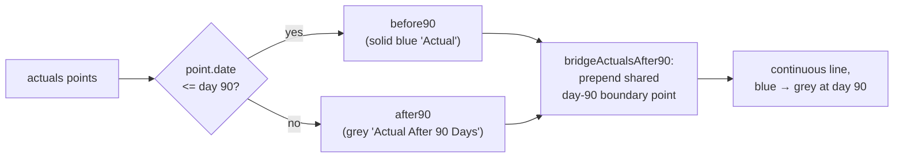

## Summary

The dashboard prediction-performance chart (`docs/app.js`) drew the **Actual**
line as two Chart.js datasets: a solid-blue "Actual" series up to the **90-Day
Target** and a faded-grey "Actual (After 90 Days)" tail after it. The day-90
boundary point lived only in the blue series and the grey series started at the
*next* point, so the two datasets shared no point and Chart.js drew no segment
between them — the visible one-segment **gap** at the split reported in the
issue.

The fix makes the actuals line **continuous** across day 90 while keeping the
intended blue → grey colour change. A new pure helper
`GRQProjection.bridgeActualsAfter90(before90, after90)` (in `docs/projection.js`)
prepends a copy of the day-90 boundary point to the after-90 series, giving the
two datasets a shared point so the grey series draws a connecting segment from
day 90 onward. The prepended point is flagged `bridge: true` (with any dividend
marker stripped) so callers render it with **no marker** (`pointRadius: 0`),
avoiding a duplicate dot over the blue boundary point. Both the single-stock and
portfolio views in `docs/app.js` use the helper.

The #496 gating is preserved: the helper returns the after-90 array verbatim
when either series is empty, and the existing
`windowShowsActualsAfter90(isMobile, windowDays)` guard still controls whether
the grey tail is drawn at all — so newer predictions (no post-90 data) and the
90-day window remain unchanged. Rendering fix only — no CSV/data change.

Closes #592.

## Evidence

Playwright MCP was unavailable in this run environment, so the before/after
visuals below are rendered directly from the **real shipped helper**
(`GRQProjection.bridgeActualsAfter90`) via
`scripts/gen_issue_592_evidence.ts`. In *Before*, the blue line ends at the
90-Day Target and the grey tail starts one point later — the gap. In *After*,
the grey tail begins at the shared day-90 boundary point, so the line is
continuous.

Before — gap at the 90-Day Target split:

After — continuous actuals across day 90:

## Test Plan

- Added `tests/chart_actuals_continuity_test.ts` exercising the real shipped
  `GRQProjection.bridgeActualsAfter90`:
  - shares the day-90 boundary point so the line is continuous (prepends the
    last before-90 point, originals follow unchanged);
  - flags the bridge point (`bridge: true`) and strips its dividend marker;
  - does not mutate the input arrays or the boundary point;
  - empty after-90 series returns verbatim (preserves #496 "no tail" gating);
  - empty before-90 series returns the after-90 series unchanged;
  - tolerates missing/invalid arguments.
- Full Deno suite: `deno test --allow-read tests/*.ts` — 1177 passed, 0 failed.
- `deno fmt`, `deno lint`, and `deno check` all clean. Rust code untouched.
