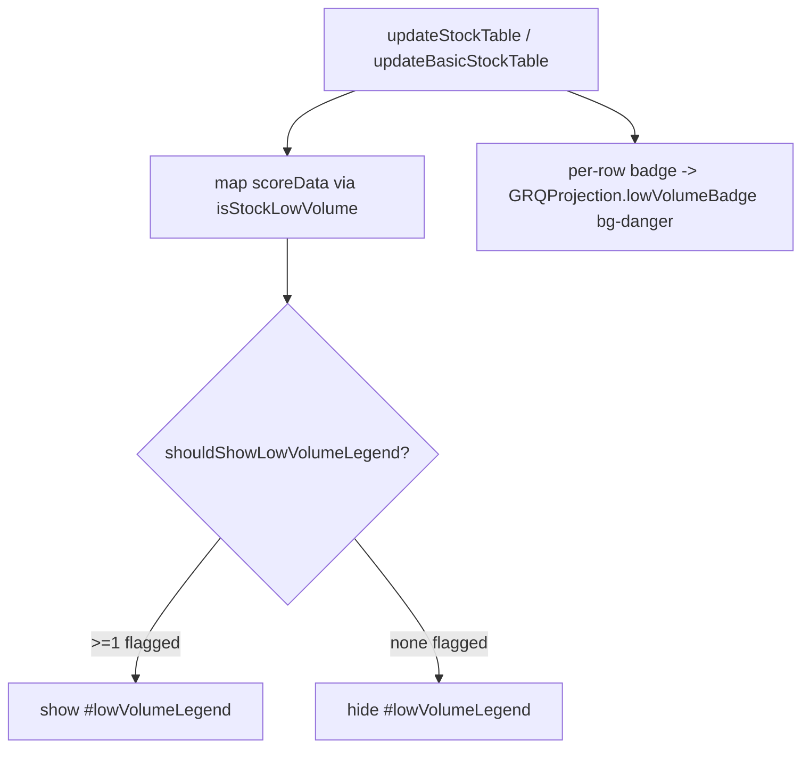

## Summary

Recolour the "Low volume" marker red and only show its legend when a low-volume
stock actually exists. A flagged name should never occur — it should have been
trained out — so when one does appear it must be called out loudly. This is a
display-only change: low-volume detection and the `$10,000` trade-budget
threshold are unchanged. Closes #599.

What changed:

- **Shared red badge kernel** — new `GRQProjection.lowVolumeBadge(label, title)`
  in `docs/projection.js` is the single source of truth for the badge markup. It
  renders Bootstrap `bg-danger` (red, with its default light text), dropping the
  old amber `bg-warning text-dark`. Both per-row badges in `docs/app.js` (the
  row "Low volume" badge, #577, and the detail "Low volume — not recommended"
  badge, #578) now delegate to it.
- **Static legend recoloured** — the legend badge in `docs/index.html` is now
  `bg-danger`.
- **Conditional legend** — the legend block (`#lowVolumeLegend`) is hidden by
  default and shown only when at least one stock in the loaded report is flagged
  low-volume. New pure kernel `GRQProjection.shouldShowLowVolumeLegend(flags)`
  decides visibility; `validator.updateLowVolumeLegend()` maps the report through
  the existing `isStockLowVolume()` predicate and is wired into both render paths
  (`updateStockTable` and `updateBasicStockTable`), so the legend and the per-row
  badges always agree.

The `.low-volume-badge` class carries layout only (font size, no-wrap), not
colour, so a Bootstrap class swap is sufficient.

## Evidence

Real reports should carry **no** low-volume names, so the screenshots below were
produced by overriding `isStockLowVolume()` to flag the first stock and
re-rendering through the production path — exercising the shipped row-badge and
conditional-legend code.

Per-row badge now red (`bg-danger`) on the first row:

Conditional legend, now red and shown only when a flagged stock is present:

## Test Plan

- Added `tests/low_volume_badge_test.ts`:
  - `lowVolumeBadge` returns `bg-danger`, never `bg-warning`/`text-dark`, keeps
    the `low-volume-badge` layout class, renders the label, includes the title
    when supplied and omits it when not.
  - `shouldShowLowVolumeLegend` is `false` for an empty / all-`false` list,
    `true` when any flag is set, and tolerant of an undefined list.
- Full Deno suite (`deno test --allow-read tests/*.ts`) passes (1186 tests);
  `deno lint` and `deno fmt --check` clean.
