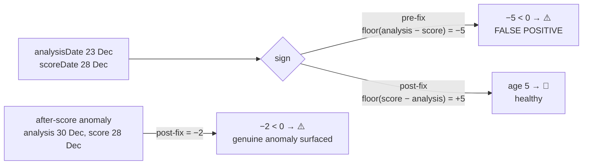

# Fix inverted fair-value freshness sign — ⚠️ wrongly fires on healthy rows

## Summary

The #547 fair-value freshness ⚠️ rendered next to the star rating of essentially
every rated stock. Root cause (diagnosed in #587): the analysis-age **sign was
inverted**. `docs/app.js` computed
`signedDaysFromScore = floor(analysisDate − scoreDate)`, which is **negative for
healthy data** — a fair-value analysis is normally dated *before* the score that
consumes it (e.g. DD analysis 23 Dec 2025 vs score 28 Dec 2025 → −5) — so the
`< 0 → ⚠️` guard fired on the normal case. The same error made a genuine anomaly
(analysis dated *after* the score) come out *positive* and be silently missed.

The fix flips the sign to `floor(scoreDate − analysisDate)` so
`signedDaysFromScore` is the true analysis age: **≥ 0 for healthy data**, negative
**only** when an analysis is dated after its score date — the genuine pipeline
anomaly the ⚠️ was meant to surface. One sign change corrects every stock and
every score date. The Stars "show working" popover (`docs/freshness_text.js`) was
already written to the corrected invariant, so it is fixed by the same change.

`Closes #600.`

### Changes

- **`docs/app.js`** — flip the sign at the `signedDaysFromScore` computation and
  tidy the inline comment to state the corrected invariant. `getFreshnessIndicator()`
  needs no logic change; the 30-day-window check uses `Math.abs` and is unaffected.
- **Cache/version bump 1.1.19 → 1.1.20** in lockstep so the SW's versioned
  caches and `skipWaiting()` ship the fix to clients: `APP_VERSION` in `docs/sw.js`, the
  `app-version` meta and `sw-register.js?v=` query in `docs/index.html` and
  `docs/trend.html`, and the `sw.js?v=` query in `docs/sw-register.js`.
  (Main already shipped 1.1.19 via #608, so the bump targets 1.1.20.)
  `docs/version.js` *derives* the version from the meta tag, so it needs no edit.
- **Regression coverage** — repurposed the #587 diagnostic
  (`scripts/freshness_indicator_diagnostic.ts` + its CLI
  `scripts/diagnose_freshness_indicator.ts`) from a bug-blast-radius diagnosis
  into a faithful port of the **corrected** freshness indicator, and updated
  `tests/freshness_indicator_diagnostic_test.ts` to assert the corrected behaviour.
- **`README.md`** — updated the script-tree descriptions for the two diagnostic files.



## Evidence

Playwright MCP was unavailable in this environment, so the dashboard could not be
screenshotted directly. Instead the fix is verified by a faithful port of the
corrected `getFreshnessIndicator` logic run against the **real** `docs/` dataset
via `deno run --allow-read scripts/diagnose_freshness_indicator.ts docs`:

```
# Fair-value freshness indicator report — issue #600

Score dates scanned:         291
Rated rows in 30-day window: 67934
  · healthy (freshness emoji): 67934
  · after-score anomalies ⚠️:  0

## Worked example — DD / 2025-12-28
  analysis dated 2025-12-23; age=5 days ⇒ 🥀 (healthy).

## After-score anomalies — every stock-date rendering ⚠️
  (none — every rated analysis is dated on/before its score)
```

Across all 67,934 rated in-window rows, **zero** now render ⚠️ (every analysis is
dated on/before its score), and DD/2025-12-28 renders 🥀 (age +5) — exactly the
issue's acceptance criteria. Pre-fix vs post-fix sign for the DD worked example:

```
DD analysis 23 Dec vs score 28 Dec
  pre-fix  signedDaysFromScore = -5  (<0 → shows the ⚠️ false positive)
  post-fix signedDaysFromScore = +5  (age 5 → 🥀, healthy)
```

## Test Plan

- **`tests/freshness_indicator_diagnostic_test.ts`** (rewritten) — asserts the
  corrected behaviour against the real functions:
  - `analyseDataset: DD/2025-12-28 is healthy — age +5 → 🥀, no ⚠️`
  - `analyseDataset: a genuine after-score anomaly renders ⚠️` (30 Dec vs 28 Dec → −2)
  - `analysisAgeDays` / `getFreshnessEmoji` sign and emoji-bucket cases, same-day,
    out-of-window, unrated, and missing-CSV cases.
  These fail against the inverted sign and pass after the fix.
- **`tests/freshness_indicator_test.ts`** (unchanged) — emoji-bucket mapping stays green.
- **`tests/stars_popover_freshness_test.ts`** (unchanged) — popover text stays green.
- Full Deno suite: `deno test --allow-read tests/*.ts` → **1188 passed, 0 failed**.

### Known unrelated failure

`./quality.sh` fails only at the Rust test `utils::tests::test_read_market_data`,
which reads files from the external `../GRQ-shareprices2026Q2` data repository.
That directory is present but **empty** in this environment, so the test's
skip-guard does not trigger and the read fails. This is a pre-existing
environmental failure — this PR contains **no Rust changes** — and is unrelated
to the freshness fix. All bash-syntax, `cargo fmt`, `clippy`, `cargo check`,
`deno fmt`, `deno lint`, `deno check`, and Deno tests pass.
