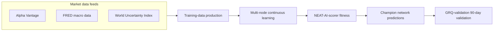

## Summary

Added a **"How the GRQ model is trained"** section to `README.md` giving a
high-level, conceptual overview (for general readers / investors) of how the
predictions this repository validates are produced. The section covers the four
requested topics — training-data production, key observations, multi-node
continuous learning, and the major market feeds — names the data providers
explicitly (Alpha Vantage, FRED, World Uncertainty Index, plus the
NYSE/NASDAQ/ASX exchanges), references the public NEAT-AI repositories, and
explains how the NEAT-AI-scorer fitness score is generated. No proprietary
code, hyper-parameters or private-repo references are disclosed. Closes #602.

The content is purely documentation — no Rust or dashboard behaviour changed.
Australian English throughout, with two Mermaid diagrams (training pipeline and
the continuous-learning fleet).

## Evidence

This is a documentation-only change (no web UI altered), so a screenshot is not
applicable. Correctness is verified by a new Deno test that asserts the
documented requirements are present.

Training/validation flow now documented in the README:

## Test Plan

- Added `tests/training_documentation_test.ts` (7 tests) verifying the README
  training section exists and covers: the four required topics, the named data
  providers, the named exchanges, the public NEAT-AI repositories, the fitness
  score formula, and the presence of a Mermaid diagram. These failed before the
  README edit and pass after it.
- `tests/documentation_accuracy_test.ts` — existing README accuracy tests still
  pass (no stale/placeholder references introduced).
- Full Deno suite: `deno test --allow-read tests/*.ts` → 1195 passed, 0 failed.
- `markdownlint-cli2 README.md` → 0 errors; `deno fmt` applied.
