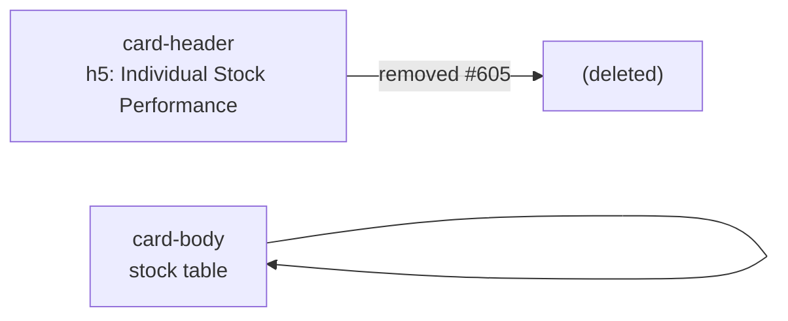

# PR Summary — Issue #605

## Summary

Deleted the "Individual Stock Performance" heading from the dashboard. The
stock-table card previously carried an `h5.card-title` header bar; the issue
asked for that heading to be removed, so the entire `.card-header` block above
the stock table was dropped, leaving the table itself unchanged. Closes #605.

## Evidence

The stock-table section is data-driven and stays hidden until a prediction date
is selected (the table populates from fetched CSV data), so a static headless
render shows the dashboard in its initial loading state. The screenshot confirms
the page still renders without errors after the markup change. Removal of the
heading itself is verified by the updated unit tests below.

## Test Plan

- `tests/dashboard_card_chrome_mobile_test.ts` — updated
  "card-header titles and section markup remain intact" to assert the
  "Individual Stock Performance" heading is now **absent** from `index.html`
  (was asserting it must remain).
- `tests/section_title_centring_test.ts` — updated
  "section titles carry the card-title hook" to expect **≥ 1** `h5.card-title`
  heading (was ≥ 2) now that one section heading has been removed; the
  remaining Market Performance Comparison heading still uses the centring hook.
- Full Deno suite: `deno test --allow-read tests/*.ts` → 1186 passed, 0 failed.
