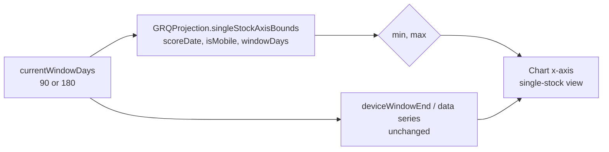

# Single-stock chart now spans the full selected window (Issue #606)

## Summary

The single-stock **Stock Performance** chart only ever plotted ~90 days even
when the 180-day window was selected. The data series was already windowed
correctly (it shares `deviceWindowEnd` / `windowShowsActualsAfter90` with the
portfolio view), but the chart's **x-axis maximum** was hard-coded to
`scoreDate + 95 days`, so Chart.js clipped the visible area at ~90 days
regardless of the chosen window. The portfolio view never hit this because it
leaves the axis undefined and auto-scales to the data.

The fix derives the single-stock axis bounds from the **same resolved window the
data series uses**, via a new pure helper `GRQProjection.singleStockAxisBounds`,
so the single-stock chart windows exactly like the portfolio view — spanning the
full selected window (90 or 180) on either desktop or mobile. A 5-day trailing
margin is preserved so the day-90 Target dot and trend endpoint are never clipped
at the edge (matching the old 90 + 5 axis for the 90-day case).

The service worker `APP_VERSION` is bumped `1.1.20 → 1.1.21` (`docs/sw.js`,
`docs/sw-register.js`, `docs/index.html`, `docs/trend.html`) so cached clients
pick up the change.

Closes #606.

## Change flow

## Evidence

180-day window — chart now runs the full window (well past the 90-day red marker,
out to ~late June):

90-day window — unchanged, still ends at the 90-day marker:

Screenshots captured with headless Chrome against a local server, deep-linked to
`?date=2026-01-01&stock=NASDAQ:SBLK&window=180` (and `window=90`).

## Test Plan

- Added `tests/single_stock_axis_window_test.ts`, exercising the real shipped
  kernel `GRQProjection.singleStockAxisBounds`:
  - desktop 180-day window spans the full 180 days (the #606 regression);
  - 90-day window keeps the historical 95-day axis (unchanged);
  - mobile/desktop parity for the same window;
  - bad stored window falls back to the device default (mobile 90 / desktop 180);
  - missing / unparseable score date returns undefined bounds (auto-scale fallback);
  - end is at local midnight regardless of score-date time-of-day.
- Full Deno suite passes (`deno test --allow-read tests/*.ts`): 1194 tests,
  including the existing `sw_precache_list_test.ts` version-alignment guard after
  the version bump.
- `deno lint` and `deno check` clean.
