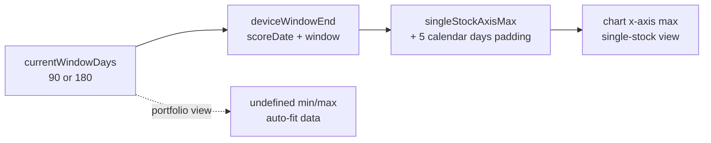

## Summary

The single-stock "Stock Performance" chart only ever plotted ~90 days of dates,
even when the **180-day** window was selected — the date axis stopped at the
day-95 mark instead of running to the full selected window. Closes #606.

Root cause: in `docs/app.js` the chart's x-axis `max` for the single-stock view
was hard-coded to `scoreDate + 95 days`, ignoring the chosen window entirely:

```js
max: this.selectedStock
  ? new Date(this.getScoreDate(this.selectedFile).getTime() + (95 * 24 * 60 * 60 * 1000))
  : undefined,
```

The portfolio view (the reference implementation) leaves `min`/`max` undefined
and auto-fits the data across the full selected window, which is why it windows
correctly. The single-stock data was already filtered to the full window
(`filteredMarketData = marketData.filter(point => point.date <= maxDate)`) and the
after-90-day actuals tail was already drawn when the window runs past day 90 —
the **only** thing capping the view was this fixed axis maximum.

Fix: derive the single-stock axis max from the same shared window resolver the
rest of the chart already uses, so the axis spans the full selected window on
both desktop (default 180) and mobile (default 90):

- Added a pure helper `GRQProjection.singleStockAxisMax(scoreDate, isMobile, windowDays)`
  in `docs/projection.js`. It returns the resolved window end
  (`deviceWindowEnd`) plus a small 5 **calendar**-day padding (so the day-90
  target dot and the projection/trend line are not clipped at the very edge).
  The padding is added with `setDate` rather than raw milliseconds so a
  daylight-saving transition inside the window cannot shift the result by a day.
  Returns `null` on a missing score date, mirroring `deviceWindowEnd`.
- `updateChart` now calls that helper for the single-stock axis `max`, threading
  the device flag and `currentWindowDays()`. The portfolio path is unchanged
  (still auto-fits). For the 90-day window this preserves the historical
  `scoreDate + 95 days` end; for 180 it now extends to the full window.
- Bumped the service-worker `APP_VERSION` 1.0.222 → 1.0.223 (via
  `scripts/bump_version.ts`, keeping `docs/sw.js`, `docs/sw-register.js`,
  `docs/index.html` and `docs/trend.html` in sync) so cached clients pick up the
  change.



## Evidence

This is a front-end chart change. A Playwright/headless-browser screenshot could
not be captured in this run: Playwright MCP was unavailable and no Chromium is
installed, and this is a Deno repo so Node/Playwright tooling was deliberately
not introduced. Verification is via the unit tests, which exercise the real
shipped shared kernel the chart resolves through:

- Before: `singleStockAxisMax` did not exist and the axis max was a fixed
  `scoreDate + 95 days`, so a 180-day window yielded only ~95 days of axis.
- After: `singleStockAxisMax(scoreDate, false, 180)` returns well past day 150
  (window end + padding), while the 90-day window still ends at day 95.

`./quality.sh` passes cleanly (lint, type-check, Rust + Deno test suites).

## Test Plan

Added `tests/chart_single_stock_axis_window_test.ts`, covering:

- `singleStockAxisMax` for the **180-day** window spans the full window
  (well past the old ~95-day cap) and tracks `deviceWindowEnd` + 5 days
  (reproduces #606).
- The 90-day window keeps the historical 95-day end (no regression to the
  default view / target-dot visibility).
- Mobile and desktop agree for the same window (device-independent, a function
  of the window).
- The axis max stays derived from the shared `deviceWindowEnd` resolver.
- A bad / out-of-range stored window falls back to the device default.
- A missing score date returns `null` (renders blank, never throws).

All existing tests continue to pass via `./quality.sh`.
