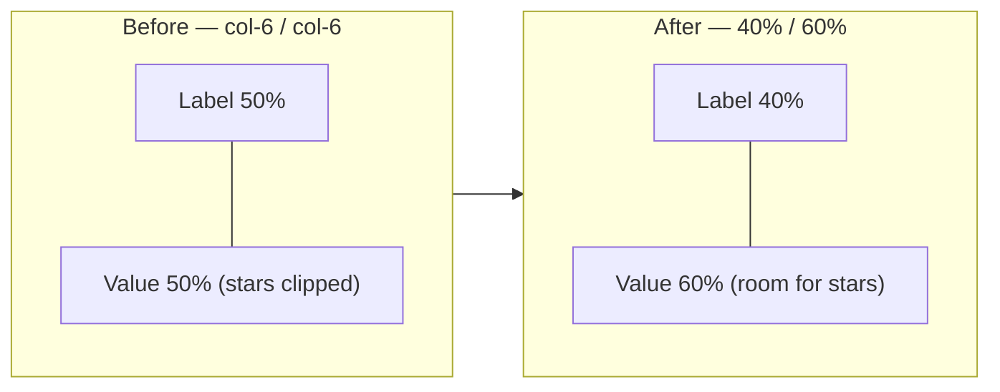

# Reduce the left label column in the mobile detail card (Issue #611)

## Summary

On a phone the stock **Detailed Information** card lays out each fact as a
`.row.mb-2` with two equal `.col-6` cells — the label on the left, the value on
the right. The 50/50 split pushed every value to start at the half-way mark, so
the **Buy Price** row (`$XX.XX` + the star rating + the freshness emoji) ran
right up against — and clipped off — the right edge.

This change narrows the left **label** column to `40%` and widens the **value**
column to `60%` on mobile (`max-width: 768px`), reclaiming the wasted left space
so the buy price and stars get more horizontal room. Desktop is unchanged.

Closes #611.

## Evidence

UI change — captured at a 390px phone viewport (3× DPR) against the live
`docs/` app. Values now begin further left, giving the Buy Price + stars more
room.

Before (50/50 split):

After (40/60 split — narrowed left label column):

## Test Plan

- Added `tests/detail_card_label_column_width_test.ts`, which reads
  `docs/styles.css` and asserts, within the `max-width: 768px` block, that:
  - the detail-card label column (`.col-6:first-child`) width is `< 50%`;
  - the value column (`.col-6:last-child`) width is `> 50%`;
  - the two widths sum to exactly `100%` so the row neither overflows nor
    underfills.
  These follow the established pure-CSS verification pattern used by
  `dashboard_horizontal_margins_test.ts` and `buy_price_one_line_detail_test.ts`.
- Full Deno suite: `deno test --allow-read tests/*.ts` → 1198 passed, 0 failed.
- `deno fmt`, `deno lint`, and `deno check` clean on the touched files.
