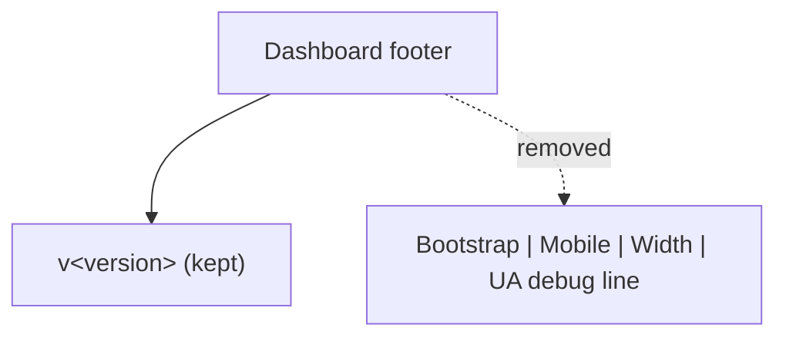

# Remove device debug info line from dashboard footer

## Summary

The dashboard footer rendered a responsive device debug readout —
`Bootstrap: <bp> | Mobile: <bool> | Width: <n>px | UA: <ua>...` — into a
`#debug-info` element, driven by `docs/dashboard_boot.js`. This debug line is no
longer wanted. Removed the element, its updater logic, and its now-dead CSS,
while keeping the useful application version line. Closes #619.

Changes:

- `docs/index.html` — dropped the `#debug-info` span (and its `<br>`) from the
  footer; the `v<span id="version">` line is retained.
- `docs/dashboard_boot.js` — removed `updateDebugInfo()` and its
  `load`/`resize` listeners; the module still loads `app.js` with the
  cache-busting version query.
- `docs/styles.css` — removed the now-unused `#debug-info` and `.debug-info`
  rules.

## Evidence

This is a front-end (HTML/CSS/JS) change. Playwright MCP and a local headless
browser were unavailable in this environment, so a rendered screenshot could
not be captured. Instead the change was verified by serving `docs/` over a
local HTTP server and inspecting the rendered footer:

```
$ curl -s http://localhost:8765/index.html | grep -A3 'Version display'
    <!-- Version display -->
    <div class="text-center text-muted small py-2">
      v<span id="version"></span>
    </div>

$ curl -s http://localhost:8765/index.html | grep -c 'debug-info'
0          # debug-info element removed; version line retained
```



## Test Plan

- Added `tests/debug_info_removed_test.ts` (TDD — written failing first, then
  made to pass):
  - `index.html no longer contains the debug-info element`
  - `index.html keeps the application version display`
  - `dashboard_boot.js no longer maintains the debug readout`
  - `dashboard_boot.js still loads app.js with the version query`
- Full Deno suite: `deno test --allow-read tests/*.ts` → 1210 passed, 0 failed.
- `deno fmt`, `deno lint`, and `deno check` pass on the changed files.

### Pre-existing unrelated failure

`quality.sh` reports one Rust failure, `utils::tests::test_read_market_data`,
because the external market-data repo (`../GRQ-shareprices2026Q2`) is present
but empty in this environment (no `SEM` data file). This failure reproduces on
a clean checkout **without** these changes and is unrelated to this docs-only
change.
