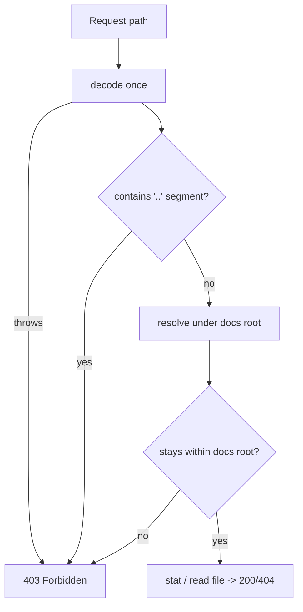

# Fix path traversal via encoded `..` in helpers/server.ts

## Summary

The static test server (`helpers/server.ts`) percent-decoded the request
path *after* URL parsing and joined it onto the docs root with no containment
check. The `URL` parser collapses literal `../` but leaves percent-encoded
dots (`%2e%2e%2f`) intact, so `decodeURIComponent` turned them back into `../`
and `join("docs", "../../etc/passwd")` escaped the docs root — letting any
client reachable on the network read arbitrary files (the server runs with
`--allow-read`).

This change hardens `getFilePath` and binds the server to loopback only.
**Closes #62.**

### What changed
- **Decode once, then reject traversal segments.** After decoding, any path
  whose segments include `..` is rejected outright.
- **Defence in depth — containment check.** The resolved absolute path is
  compared against the resolved docs root with `resolve` + `relative`; anything
  that resolves outside (`..`-prefixed or absolute) is rejected.
- **Malformed escapes rejected.** A lone `%` (which makes `decodeURIComponent`
  throw) is caught and rejected instead of 500-ing.
- `getFilePath` now returns `string | null`; `handleRequest` responds **403
  Forbidden** for a `null` result.
- **Bind to `127.0.0.1`** instead of all interfaces — this is a local test
  server, not a public host.
- Server startup is guarded by `import.meta.main` and `getFilePath` /
  `handleRequest` are exported, so the logic is unit-testable without binding a
  socket.
- Added `@std/path` to `deno.json` imports for the test's bare specifier.

### Request flow



## Evidence

Backend/CLI change — no web UI to screenshot. Verified via unit tests that
call the real `getFilePath` with the issue's exploit payloads:

```
ok | 10 passed | 0 failed (102ms)
```

The new test `getFilePath - rejects encoded ../ traversal to /etc/passwd`
reproduces the issue trigger (`GET /%2e%2e/%2e%2e/%2e%2e/etc/passwd`) and now
returns `null` (→ 403) instead of resolving outside the docs root. Full deno
suite: `113 passed | 0 failed`.

## Test Plan

Added `tests/server_path_traversal_test.ts`:
- **Happy path** — root, explicit `index.html`, nested asset, and `docs/`-prefixed
  paths all resolve inside the docs root.
- **Error path** — encoded `../` to `/etc/passwd`, literal `../`, traversal
  behind a `docs/` prefix, mixed encoded/literal traversal, and malformed
  percent-encoding are all rejected (`null`).
- **Edge case** — a filename merely containing dots (`my..file.txt`) is still
  served.
