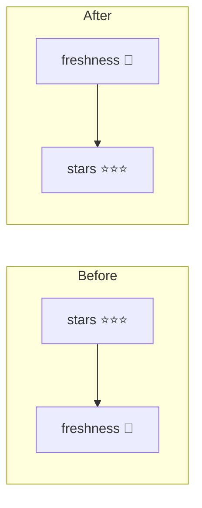

## Summary

Flipped the order of the inline Stars-cell emojis so the fair-value **freshness
indicator now leads the star rating** — `🌺 🌕🌕🌕🌑` instead of
`🌕🌕🌕🌑 🌺`. The number of stars varies per stock, so leading with the
constant freshness emoji and trailing the variable-length stars gives a more
consistent visual line, as requested. The change applies to both render sites
in `docs/app.js`: the aggregate-score table "Stars" cell and the mobile detail
card's compact `.star-rating` span. The existing N/A guards are preserved — when
the stars are N/A both helpers return `''`, so the cell stays empty with no
stray leading space.

Closes #623.

## Evidence

Dashboard table after the change — the freshness emoji (🥀) renders first,
followed by the star glyphs:

Order before vs after:

## Test Plan

TDD — updated the existing behavioural expectations first, then changed the
markup to satisfy them:

- `tests/star_rating_test.ts` — `renderStarsCell` helper and its assertions now
  expect freshness-then-stars (`🌺 🌕🌕🌕🌑`, `🌹 🌕🌕🌕🌕`, `⚠️ 🌕🌕🌕🌕`),
  plus the N/A cases still produce an empty cell. The `app.js` wiring test now
  asserts a guarded `getFreshnessIndicator` is emitted **before**
  `getStarRatingDisplay`.
- `tests/buy_price_one_line_detail_test.ts` — the detail-card span test now
  asserts freshness is prepended before the stars; the star-block truthiness
  guard test is unchanged and still passes.
- `tests/detail_card_label_column_width_test.ts` — updated the illustrative
  comment to the new emoji order (CSS-only test, behaviour unchanged).

All 1213 Deno tests pass (`deno test --allow-read tests/*.ts`); `deno fmt`,
`deno lint`, and `deno check` are clean. No Rust files were touched.
