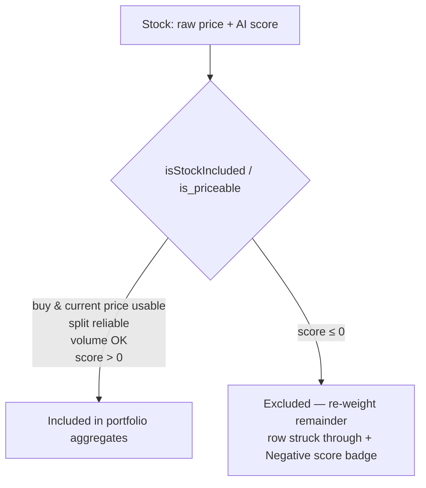

## Summary

Exclude any stock with a **negative (or zero) AI model score** from the
dashboard's portfolio aggregate figures. A score ≤ 0 means the model predicts
the stock will fall, so we would hold cash rather than buy it. Such a name is now
dropped from the portfolio and from every aggregate (equal-weight) figure —
re-weighting the remaining stocks — exactly mirroring the existing low-volume
exclusion (#577). The excluded stock stays visible in the table with a red
**Negative score** badge and a struck-through row, and a conditional legend
explains the badge whenever at least one stock is affected. **Closes #627.**

The rule is implemented in the **single inclusion predicate** that is the shared
source of truth, so the JS dashboard and the Rust backend agree:

- `isStockIncluded` (`docs/projection.js`) gains a `score` parameter and excludes
  when the raw score is a number ≤ 0. The three aggregate helpers
  (`calculateIncludedPortfolioPerformance`,
  `calculateIncludedPortfolioDividendYield`,
  `calculatePortfolioTargetPercentage`) pass each stock's `score` through.
- `is_priceable` (`src/utils.rs`) gains a `score` parameter and excludes when the
  score is ≤ 0; both production callers pass `record.score`.
- `docs/app.js` looks the raw score up in `isStockPriceable` (the gate feeding the
  chart Actual line, the totals row and the dividend figures), adds the
  **Negative score** badge to the aggregate table, and shows the new conditional
  legend.

The gate keys on the **raw** model score, not the volume-capped display score
(#578). An unknown/missing score (null/undefined/NaN in JS) never excludes, so
historical data without a usable score is never mass-dropped. As the issue notes,
the top-20 selection means no negative scores exist today (lowest is 0.174), so
this is a defensive, forward-looking rule with no immediate effect on displayed
figures.

## Evidence

UI change. Screenshot of the aggregate table with a stock (`NYSE:ELME`) whose
score was temporarily set to `-0.5` to demonstrate the rule (the fixture edit was
reverted before committing — no fake data is committed). The row shows the red
**Negative score** badge and is struck through, confirming it is excluded from
the aggregates while remaining visible:

## Test Plan

JS (`tests/exclusion_reweight_test.ts`, run with `deno test --allow-read`):

- `isStockIncluded - positive score -> included`
- `isStockIncluded - zero score -> excluded`
- `isStockIncluded - negative score -> excluded`
- `isStockIncluded - missing/unknown score -> not excluded on score`
- `re-weighting - negative-score stock dropped and weight redistributed`
- `re-weighting - zero-score stock excluded`

Rust (`src/utils.rs`, `cargo test`):

- `test_is_priceable_positive_score_included`
- `test_is_priceable_zero_score_excludes_otherwise_priceable_stock`
- `test_is_priceable_negative_score_excludes_otherwise_priceable_stock`
- `test_portfolio_performance_excludes_negative_score_stock` — full
  `calculate_portfolio_performance` regression: a negative-score stock drops from
  the count and average and appears in `excluded_tickers`.
- Updated the `is_priceable` doc-test and all existing `is_priceable` call sites
  to the new 4-argument signature (added a positive score to preserve their
  original price/split intent).

All new tests pass. The full Deno suite passes (1219 passed). `cargo fmt`,
`cargo clippy`, and the Rust library tests pass, except the pre-existing
`utils::tests::test_read_market_data`, which requires the external
market-data repository (verified failing on the unmodified
baseline — unrelated to this change).
