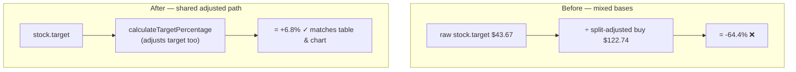

# Fix Portfolio Target "show working" per-stock % for split-adjusted stocks

## Summary

The Portfolio Target "show working" popover listed the wrong per-stock target %
for a split-adjusted stock — **NYSE:DD** showed **-64.4%** when its true target
is **+6.8%** (DD had a 1:3 reverse split, `split_coefficient` 0.3333, on
2026-06-24).

Root cause: the popover's per-stock loop in `docs/app.js`
(`getWorking`, field `portfolio-target`) divided the **raw** `stock.target` by
the **already split-adjusted** buy price — mixed bases. Every other consumer
(table target, chart target dot, per-stock Target popover, and the headline)
adjusts the target too via the shared `calculateTargetPercentage` →
`adjustHistoricalPriceToCurrent` path.

The fix replaces the raw recomputation with a call to the shared
`this.calculateTargetPercentage(stock, scoreDate)`, so the popover's per-stock
list, its `Total ÷ N stocks` line, and the `Portfolio target` headline all share
one source of truth with the table and chart. The `sw.js` `APP_VERSION` and the
`app-version` meta (plus the `sw-register.js`/`trend.html` references) are bumped
`1.1.29 → 1.1.30` so cached clients pick up the fix.

Closes #629.

## Evidence

Playwright MCP was unavailable in this environment, so the fix is verified
numerically against the **real** committed market-data series rather than by
screenshot.

Driving the real shared helpers (`getBuyPrice`,
`adjustHistoricalPriceToCurrent`, `calculateTargetPercentage`) over DD's actual
series in `docs/scores/2025/December/29.csv`:

| Quantity | Value |
| --- | --- |
| Split factor (score date → now) | 0.3333 |
| Adjusted buy price | $122.71 |
| Adjusted target | $131.01 |
| **Fixed per-stock %** | **+6.8%** |
| Old buggy per-stock % | -64.4% |

The fixed figure (+6.8%) matches the issue's stated correct value; the old
mixed-base figure (-64.4%) matches the reported screenshot.

## Test Plan

- Added `tests/portfolio_target_popover_split_test.ts`:
  - `portfolio-target popover uses the split-adjusted per-stock % (issue #629)` —
    drives the **real shipped** `GRQValidator.getWorking` method (extracted from
    `docs/app.js` without its DOM-bound constructor) over a reverse-split fixture
    where the adjusted path (+6.8%) and the old raw path (-64.4%) differ
    visibly. Asserts the popover shows `NYSE:DD: 6.8%`, never `-64.4`, and that
    the `Total ÷ N` line reconciles with the `Portfolio target` headline. This
    test **fails against the unfixed `app.js`** and passes with the fix.
  - `calculateTargetPercentage drives the popover via the shared adjusted helper`
    — anchors the +6.8% adjusted figure (and the -64.4% buggy figure) to the
    shared `GRQProjection.calculateTargetPercentage` kernel.
- Full suite: `deno test --allow-read tests/*.ts` → **1221 passed, 0 failed**.
- `deno lint` and `deno check` over `tests/*.ts` pass clean.
