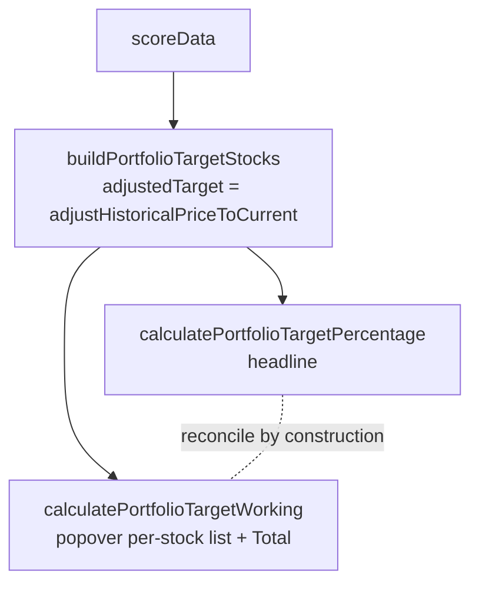

## Summary

Fixed the Portfolio Target "show the working" popover, which listed wrong
per-stock targets for split/dilution-adjusted stocks (e.g. **NYSE:DD −64.4%**
instead of the correct **+6.8%**). Closes #629.

The popover's per-stock loop (`docs/app.js`, `getWorking`, field
`portfolio-target`) computed each stock's % from the **raw** `stock.target`
divided by the **split-adjusted** buy price — mixing bases. For NYSE:DD, which
had a 1:3 reverse split (`split_coefficient` 0.3333), it did
`43.67 ÷ (40.90 ÷ 0.3333 = 122.74) = −64.4%`, whereas the correct adjusted
basis is `(43.67 ÷ 0.3333 = 131.04) vs 122.74 = +6.8%`. Every other consumer
(table target, chart dot, per-stock Target popover, headline) already adjusts
the target via the shared `adjustHistoricalPriceToCurrent` path.

### Fix (DRY — single source of truth)

- Added `calculatePortfolioTargetWorking(stocks)` to `docs/projection.js`. It
  returns `{ details, total, validStocks }` from the **same** split/dilution
  adjusted inputs the headline uses, and `calculatePortfolioTargetPercentage`
  now delegates to it — so the per-stock list, the `Total ÷ N stocks` line and
  the `Portfolio target` headline reconcile **by construction**.
- Extracted `buildPortfolioTargetStocks()` in `docs/app.js` so the headline and
  the popover consume identical inputs (the adjusted target, never raw
  `stock.target`). The popover branch now calls the shared helper instead of
  recomputing from raw values.
- Bumped `APP_VERSION` 1.1.29 → **1.1.30** (`sw.js`, `index.html`, `trend.html`,
  `sw-register.js`) via `scripts/bump_version.ts` so cached clients pick up the
  fix.

## Evidence

Playwright MCP browser tools were not available in this environment, so a
popover screenshot could not be captured. The fix is a pure calculation change
verified by unit tests driving the **real shipped helper** with a DD-style
reverse-split fixture (coeff 0.3333):

- `calculatePortfolioTargetWorking` returns **+6.8%** for the DD-style stock
  using the adjusted basis (the old code produced −64.4%).
- The popover `Total ÷ validStocks` equals `calculatePortfolioTargetPercentage`
  (the headline) to within 1e-9 — confirming reconciliation.

All related Deno suites pass (`portfolio_target_working_test.ts`,
`portfolio_target_tests.ts`, `portfolio_actual_dividends_popover_test.ts`,
`projection_module_test.ts`, `js_syntax_test.ts`).

> Note: the Rust suite has one pre-existing, environment-dependent failure
> (`utils::tests::test_read_market_data`) that requires an external market-data
> repository absent from this machine. It is unrelated to this JS-only change.

## Test Plan

- Added `tests/portfolio_target_working_test.ts`:
  - `reverse-split stock uses adjusted basis (not raw target)` — DD-style coeff
    0.3333 yields +6.8%, reproducing #629.
  - `Total reconciles with the headline` — popover Total ÷ N equals
    `calculatePortfolioTargetPercentage`.
  - `excludes unpriceable stocks from the list` — exclusion/inclusion gate.
  - `empty / non-array inputs are safe` — defensive edge cases.
- Existing `tests/portfolio_target_tests.ts` continues to pass against the
  refactored `calculatePortfolioTargetPercentage`.
