# Fix stored/DOM XSS via unescaped TSV fields (Issue #63)

## Summary

The dashboard rendered untrusted TSV-derived fields (`stock.stock`, `stock.notes`,
`stock.exDividendDate`) straight into `innerHTML` template literals with no
escaping, allowing stored/DOM XSS from any crafted score file. A ticker such as
`'),alert(document.domain)//` broke out of the inline `onclick` string, and a
notes value such as `` injected live markup.

This change adds a shared escaping module and applies it at every affected render
sink, escaping at **render time** (not parse time) so the raw values remain
usable as lookup keys, chart labels and CSV filenames elsewhere in the app.

`Closes #63`

### What changed

- **`docs/escape.js`** (new) — `escapeHtml()` (HTML text / double-quoted
  attribute context) and `escapeJsString()` (JavaScript-string context, e.g.
  inline `onclick`). Published on `globalThis` so it works both as a classic
  `<script>` in the dashboard and when imported by Deno tests. Loaded before
  `app.js` in `docs/index.html`.
- **`docs/app.js`** — escaped the untrusted fields at three render sites:
  - the stock detail card (ticker + notes),
  - the aggregate performance row (ticker in text, attribute **and** the
    `onclick` JS-string — double-escaped via `escapeHtml(escapeJsString(...))`),
  - the portfolio summary table (ticker, ex-dividend date, notes).
- Function-call arguments (e.g. `getStarRatingDisplay(stock.stock)`) and
  `data-stock` round-trips are left on the **raw** value, so lookups and popovers
  keep working — the browser decodes HTML entities back to the original ticker
  when reading attributes via `dataset`.

### Why render-time, not parse-time

`stock.stock` is used as a key for `this.marketData[stock.stock]`, `getBuyPrice`,
chart legends, CSV filenames and more. Escaping in `loadScoreData` would corrupt
all of those. Escaping at each DOM sink fixes the vulnerability without breaking
data lookups.

```mermaid
flowchart LR
    A[scores/*.tsv<br/>untrusted] --> B[loadScoreData<br/>raw values kept]
    B --> C{render sink}
    C -->|HTML text / attr| D[escapeHtml]
    C -->|onclick JS string| E[escapeHtml &#183; escapeJsString]
    B -->|lookup keys, chart labels| F[raw value unchanged]
    D --> G[Safe DOM]
    E --> G
```

## Evidence

Headless-Chrome render of the malicious payloads through the real `escape.js`
helpers at the same sinks used by `docs/app.js`: the `` notes
payload renders as inert text and the `onclick` breakout never fires.

The full dashboard also continues to render normally with `escape.js` loaded
(legitimate alphanumeric tickers are unchanged by `escapeHtml`).

## Test Plan

- Added `tests/escape_test.ts`, which imports the real `docs/escape.js` and
  asserts on behaviour (not source text):
  - `escapeHtml` encodes `< > & " '`, neutralises an `` payload,
    leaves ordinary tickers/notes untouched, and returns `""` for null/undefined.
  - `escapeJsString` escapes quotes/backslashes; the wrapped literal `eval`s back
    to the original payload (proving no string breakout).
  - Combined `onclick` context test: `escapeHtml(escapeJsString(ticker))` after
    HTML-attribute decoding yields the original ticker as a single inert argument.
- `deno test --allow-read tests/*.ts` — 122 passed, 0 failed.
- `node --check docs/app.js` / `docs/escape.js` — syntax valid.

## Security self-check

- Input validation / output encoding: all untrusted TSV-derived values are now
  encoded for their target sink (HTML text, HTML attribute, JS string).
- No secrets staged; no new dependencies; no new injection surface introduced.
