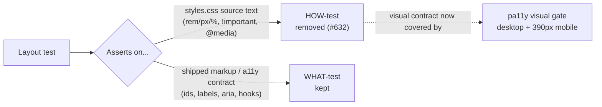

# Replace `styles.css` source-text-grep layout tests with behaviour contracts

## Summary

A large family of mobile/desktop layout tests asserted on the **literal text of
CSS rules** in `docs/styles.css` rather than on any observable rendered
behaviour. Each read the stylesheet as text via shared `ruleBody`/`mediaBlock`/
`lengthOf` helpers and then pinned exact `rem`/`px`/`%` values, the presence of
`!important` tokens, and which `@media` block a selector lived in. This is the
classic **source-text-grep anti-pattern** (a HOW-test, not a WHAT-test): a
behaviour-preserving restyle — collapsing four padding declarations into a
`padding` shorthand, centring via `justify-content: center` instead of
`text-align: center`, re-balancing two columns with `flex-basis` instead of
literal `width: NN%` — leaves the rendered page identical yet trips the grep,
gating any restyle of the whole stylesheet with false failures.

This PR removes the brittle CSS source-text assertions while preserving each
test's genuine contract. **Closes #632.**

Two resolutions were applied per the issue's guidance:

- **Deleted three files** that were *purely* `styles.css` source-text greps
  pinning historical constants (the `1600px`/`2000px` cap, the `0.375rem`
  gutter, literal `width: NN%` column splits) with no markup or behaviour
  contract left once the greps were removed:
  - `tests/dashboard_horizontal_margins_test.ts`
  - `tests/dashboard_desktop_margins_test.ts`
  - `tests/detail_card_label_column_width_test.ts`
- **Stripped the `styles.css` grep assertions** from the remaining files,
  keeping their genuine markup / feature / accessibility contracts that survive
  any behaviour-preserving restyle:
  - `tests/header_banner_mobile_test.ts` — keeps banner title, subtitle, theme
    toggle.
  - `tests/header_chrome_compact_mobile_test.ts` — keeps the `<h1>` title, lead
    subtitle, theme toggle and the labelled Prediction Date control.
  - `tests/dashboard_section_spacing_mobile_test.ts` — keeps section/control ids.
  - `tests/dashboard_card_chrome_mobile_test.ts` — keeps card-header titles and
    section markup.
  - `tests/section_title_centring_test.ts` — keeps the `h5.card-title` hook the
    centring rule targets.
  - `tests/chart_controls_heading_row_test.ts` /
    `tests/chart_controls_trend_line_test.ts` — drop the `display: flex` grep;
    keep the markup-order/grouping contracts.
  - `tests/chart_window_unit_label_test.ts` — drop the
    `css.includes(".chart-window-unit")` grep; keep the visible-label and
    `aria-label`/`aria-hidden` accessibility contracts.
  - `tests/buy_price_one_line_detail_test.ts` — drop the `white-space`/
    `font-size`/`letter-spacing` greps; keep the `app.js` markup-hook and
    rendered-template contracts.

The **rendered layout itself** (shrunk banner, flattened cards, one-line
controls, reclaimed margins) is exercised by the repository's existing **pa11y**
visual gate, which renders `index.html`/`trend.html` at desktop and 390px mobile
viewports — a far more robust check of the visual contract than dozens of
brittle `ruleBody` greps.

### Note on removed tests

Per the issue (which explicitly states *"deleting a counter-productive test is
an acceptable PR outcome"*), the CSS source-text assertions and three
whole files were removed. No behaviour was lost: the deleted assertions only
verified that particular strings appeared in `styles.css`, not that the
dashboard renders the way the user needs. Every retained file still calls a real
read of the shipped artefact and asserts on a contract that holds across any
behaviour-preserving restyle.

## Evidence

This is a test-quality change to the Deno test suite (no application/UI code
changed), so there is no new screenshot. Verification is the test runs below.



Targeted run of the changed files (all pass):

```
deno test --allow-read --allow-env tests/header_banner_mobile_test.ts \
  tests/header_chrome_compact_mobile_test.ts \
  tests/dashboard_section_spacing_mobile_test.ts \
  tests/dashboard_card_chrome_mobile_test.ts tests/section_title_centring_test.ts \
  tests/chart_controls_heading_row_test.ts tests/chart_controls_trend_line_test.ts \
  tests/chart_window_unit_label_test.ts tests/buy_price_one_line_detail_test.ts
ok | 20 passed | 0 failed
```

Full Deno suite after the change: `ok | 1199 passed (79 steps) | 0 failed`.

## Test Plan

- Removed the `styles.css` source-text-grep assertions and their unused
  `ruleBody`/`mediaBlock`/`lengthOf`/`emOf` helpers from nine files; deleted
  three files whose only content was such greps.
- Retained, in each surviving file, the markup/feature/accessibility contracts
  that assert on the shipped `index.html`/`app.js` artefacts.
- `deno fmt`, `deno lint` and `deno check` pass over the test suite; the full
  Deno test suite passes (`1199 passed`).
