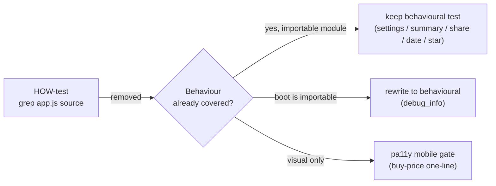

# Remove source-text-grep "wiring" tests (issue #633)

## Summary

Several "wiring" tests asserted on the **source text of `docs/app.js`** (and a
couple of other shipped JS files) rather than on observable behaviour — grepping
for internal identifier names and regex-matching the exact spelling of template
literals and call-site syntax. These are HOW-tests: they pass even if the wired
behaviour is broken (they never run the code) and break on any rename, inline or
reformat that preserves behaviour. This PR removes the grep tails and, where a
real harness was feasible, replaces them with behavioural assertions that drive
the shipped code and check its observable effects. Closes #633.

The audit-flagged behaviour is already covered behaviourally elsewhere, so no
real coverage is lost — only the false coverage that passed for the wrong reason.

## Changes per file

| File | What changed | Behaviour now covered by |
| --- | --- | --- |
| `tests/debug_info_removed_test.ts` | **Rewritten to behaviour.** The `dashboard_boot.js` greps (`updateDebugInfo`, `navigator.userAgent`, `app.js?v=`) are replaced with a test that drives the real boot against a fake DOM and asserts its effects: it appends exactly one `app.js?v=<version>` script and never populates a reachable `#debug-info` element. | this file (real boot driven headless) |
| `tests/chart_window_toggle_test.ts` | **Removed the app.js source-grep wiring block** (a whole module's internal helper names: `initChartWindowToggle`, `currentWindowDays`, `desktopWindowDays`, `GRQChartWindow.read/writeMobile/DesktopWindowDays`, `isMobileDevice`, `deviceWindowEnd`/`deviceWindowDays` call-site regexes). HTML/CSS markup contracts kept. | `chart_window_settings_test.ts` (store read/write), `chart_summary_window_test.ts` (window maths) |
| `tests/share_button_wiring_test.ts` | **Removed the grep tail** (`GRQShare.initShareButton`, `getState … this.shareState()`). The behavioural body already drives the real `share_link.js` DOM wiring. | same file (a tap reads `getState`, builds + surfaces the deep link) |
| `tests/date_url_roundtrip_test.ts` | **Removed the app.js / trend.js source greps** (`updateDateDeepLinks`, `history.replaceState`, `updateDashboardBackLink`, call-site regex). Behavioural round-trip over the real `date_selection.js` helpers and the static markup-id contract kept. | same file (dropdown → `?date=` → reload, Trend ← Dashboard hop) |
| `tests/star_rating_test.ts` | **Removed the grep tail** that regex-matched the `<td>` template-literal spelling. | same file (`renderStarsCell` behavioural tests assert the rendered string) |
| `tests/buy_price_one_line_detail_test.ts` | **Deleted.** The whole file was source-grep over `app.js` template literals with no behavioural body. | pa11y visual gate at the 390×844 mobile viewport (one-line rendering); `star_rating_test.ts` (rating output) |

> **Documented test changes (instruction #2):** this issue is a test-audit whose
> explicit purpose is to remove/rewrite these HOW-tests. `app.js` bootstraps a
> live `GRQValidator` at import time and touches dozens of DOM nodes, so it
> cannot be imported headless to assert its wiring behaviourally without a large,
> out-of-scope refactor; the grep tails were therefore removed rather than
> replaced with another grep. Each removal is justified above by existing
> behavioural coverage.

## Evidence

This is a test-only change to Deno test files (no production code, no web UI
change), so there is no screenshot. Verification is the test run below.

- Full Deno suite: `deno test --allow-read tests/*.ts` → **1185 passed, 0 failed**.
- `deno fmt --check`, `deno lint`, `deno check` over `docs/`, `helpers/`, `tests/` all clean.

## Test Plan

- Rewrote `tests/debug_info_removed_test.ts`: added behavioural tests
  `dashboard_boot.js loads app.js with the cache-busting version` and
  `dashboard_boot.js does not populate a device debug readout` that run the real
  bootstrap against a fake DOM.
- Removed source-grep `Deno.test` blocks from `chart_window_toggle_test.ts`,
  `share_button_wiring_test.ts`, `date_url_roundtrip_test.ts`,
  `star_rating_test.ts`; documenting comments record why and where the behaviour
  is covered.
- Deleted `tests/buy_price_one_line_detail_test.ts` (grep-only).
- Confirmed remaining behavioural tests in each touched file still pass and the
  full suite is green.
