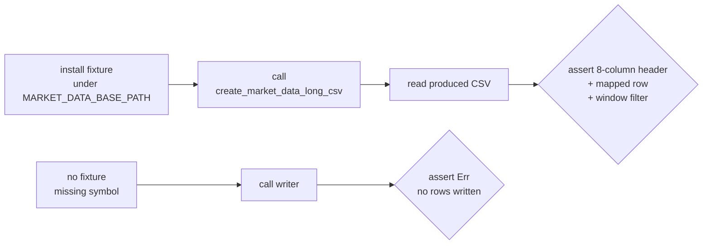

## Summary

`create_market_data_long_csv` (`src/utils.rs:735`) — the primary long-format
market-data writer on the batch critical path — had **no unconditional test**.
Its only test-adjacent reference, the wrapper
`create_market_data_long_csv_for_score_file`, early-returns unless an external
`MARKET_DATA_BASE_PATH` repository exists, so on CI and most machines the
8-column writer, the per-ticker skip handling, and the "no rows written →
error" guard (`src/utils.rs:804-809`) were never asserted.

This PR adds fixture-backed behaviour (WHAT) tests in
`tests/create_market_data_long_csv_test.rs`, mirroring the short-format sibling
`tests/create_market_data_csv_test.rs` (issue #265). No production code
changed — this is a pure coverage gap fix.

Closes #634.

## Evidence

Backend/CLI change with no web interface — no screenshot applicable.

The tests drop a small, fully controlled market-data fixture at the location
the function reads from (via an RAII guard that removes exactly what it
created), so they run unconditionally without depending on the external data
repository. Assertions pin the observable contract — the bytes written and the
`Result` returned — not internal call order.



Test run:

```
running 2 tests
test create_market_data_long_csv_errors_when_all_tickers_skipped ... ok
test create_market_data_long_csv_writes_eight_column_rows ... ok

test result: ok. 2 passed; 0 failed
```

`./quality.sh` passes cleanly (1185 tests, fmt/lint/check all green).

## Test Plan

Added `tests/create_market_data_long_csv_test.rs`:

- `create_market_data_long_csv_writes_eight_column_rows` — installs a fixture
  with distinct open/high/low/close/volume/split values for an in-window date
  plus rows before and after the 180-day window, calls the writer, and asserts
  the `date,ticker,high,low,open,close,split_coefficient,volume` header, the
  fully-mapped in-window row (with the full exchange-prefixed ticker preserved),
  and that out-of-window rows are excluded.
- `create_market_data_long_csv_errors_when_all_tickers_skipped` — calls the
  writer with a single synthetic ticker that has no market-data file, so every
  ticker is skipped and no rows are written, then asserts the documented
  "no rows written" error is returned (`src/utils.rs:804-809`).
