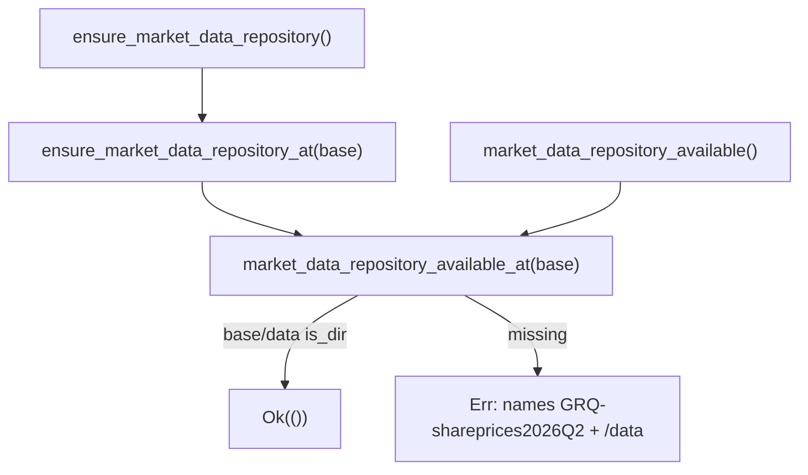

## Summary

Added WHAT-tests for the previously untested market-data repository guards in
`src/utils.rs`: `ensure_market_data_repository`, `is_market_data_csv_empty`, and
the shared probe `market_data_repository_available`. Closes #636.

To make the repository guards deterministically testable without racing on the
fixed sibling path (`../GRQ-shareprices2026Q2`), the availability check and the
ensure-guard were given small path-injectable cores
(`market_data_repository_available_at` / `ensure_market_data_repository_at`); the
public functions now delegate to these. Behaviour is unchanged — for the public
path the error message is byte-for-byte identical to before (it still names
`GRQ-shareprices2026Q2` and the missing `/data` directory). `main.rs` was not
touched.

## Evidence

Backend/CLI change — no web interface to screenshot. Verified via Rust unit
tests (all five new tests pass):

```
test utils::tests::test_is_market_data_csv_empty_missing_file ... ok
test utils::tests::test_is_market_data_csv_empty_header_only ... ok
test utils::tests::test_is_market_data_csv_empty_with_data_row ... ok
test utils::tests::test_ensure_market_data_repository_ok_when_present ... ok
test utils::tests::test_ensure_market_data_repository_err_when_absent ... ok
```

`cargo fmt --all -- --check` and `cargo clippy --tests --all-features -D warnings`
both pass.



### Pre-existing unrelated failure

`./quality.sh` surfaces one failing test, `utils::tests::test_read_market_data`,
which fails on the **unmodified** tree too (confirmed via `git stash`). Its skip
guard checks `MARKET_DATA_BASE_PATH).exists()` (the bare sibling checkout exists)
rather than the `data/` subdir, so it is not skipped yet has no data files to
read. This is an environment-dependent, pre-existing issue outside the scope of
#636 and is left unchanged.

## Test Plan

Added to the `#[cfg(test)]` module in `src/utils.rs`:

- `test_is_market_data_csv_empty_missing_file` — missing path returns `true`.
- `test_is_market_data_csv_empty_header_only` — header-only (plus blank lines)
  returns `true`.
- `test_is_market_data_csv_empty_with_data_row` — header + one data row returns
  `false`.
- `test_ensure_market_data_repository_ok_when_present` — a `tempdir` containing a
  `data/` subdir gives `Ok(())` (covers the `available` `true` branch).
- `test_ensure_market_data_repository_err_when_absent` — a `tempdir` without
  `data/` gives an `Err` whose message names the repository and the missing
  `/data` directory (covers the `false` branch).

All assertions are on the returned `Result`/`bool`, not on internal calls.
