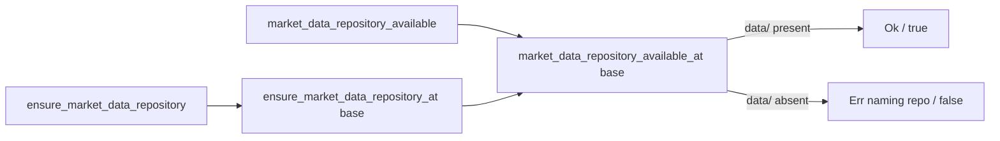

# Test market-data repository guards in `src/utils.rs`

## Summary

Three public functions that gate the batch-processing entry path in
`src/utils.rs` had **no test**: `ensure_market_data_repository`,
`is_market_data_csv_empty`, and the probe `market_data_repository_available`
they share. A silent regression in the empty-detection predicate or the
missing-repository error branch would have shipped green.

This PR adds WHAT-tests asserting the observable `Result`/`bool` return values
(no `main.rs` change). To exercise the repository-presence logic
deterministically — the sibling data repo is absent in CI and changing the
process CWD is not safe under parallel tests — the path check was extracted into
two behaviour-preserving, base-path-relative cores
(`market_data_repository_available_at`, `ensure_market_data_repository_at`). The
public wrappers pass `MARKET_DATA_BASE_PATH`, so the error message is
byte-for-byte identical to before.

Closes #636.

## Evidence

Backend/CLI change only — no web interface to screenshot. Verified via the test
suite. The six new tests pass and `./quality.sh` completes cleanly (fmt, clippy
`-D warnings`, check, full `cargo test`, plus the Deno checks).



New test run:

```
running 6 tests
test utils::tests::test_is_market_data_csv_empty_missing_file_is_empty ... ok
test utils::tests::test_is_market_data_csv_empty_header_only_is_empty ... ok
test utils::tests::test_is_market_data_csv_empty_with_data_row_is_not_empty ... ok
test utils::tests::test_market_data_repository_available_at_detects_data_dir ... ok
test utils::tests::test_ensure_market_data_repository_at_ok_when_present ... ok
test utils::tests::test_ensure_market_data_repository_at_errors_when_absent ... ok
test result: ok. 6 passed; 0 failed
```

## Test Plan

Added to `src/utils.rs` `#[cfg(test)] mod tests`:

- `test_is_market_data_csv_empty_missing_file_is_empty` — missing path → `true`.
- `test_is_market_data_csv_empty_header_only_is_empty` — header-only file (blank
  lines ignored) → `true`.
- `test_is_market_data_csv_empty_with_data_row_is_not_empty` — header + one data
  row → `false`.
- `test_market_data_repository_available_at_detects_data_dir` — `false` without a
  `data/` dir, `true` once present (covers both branches of the probe).
- `test_ensure_market_data_repository_at_ok_when_present` — `Ok(())` when `data/`
  exists.
- `test_ensure_market_data_repository_at_errors_when_absent` — `Err` whose
  message names the missing repository and `/data` path.

All assertions are on the returned `Result`/`bool`, not on internal calls.
