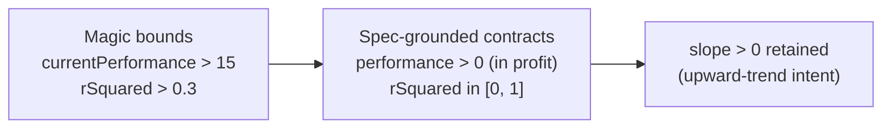

## Summary

`tests/schw_projection_test.ts` carried two fixture-coupled **magic lower-bound
thresholds** with no spec derivation — the same anti-pattern the file's own
header criticises and replaces for the 90-day projection assertion. This PR
rewrites both to assert what the spec actually requires instead of the number
the maths happens to emit against the frozen SCHW fixture. Closes #637.

- **Current performance** (`currentPerformance > 15`, line 294): replaced with
  the meaningful qualitative contract that the SCHW position is in profit
  (`> 0`). The `> 15` magnitude was tied to the value the current
  buy-price/smoothing maths emits (~17.2%) and would need rewriting on any
  benign retune even while the position is still correctly profitable. The
  precise projection magnitude is already pinned spec-derived by the adjacent
  90-day projection step (`projected = currentPerformance * 90 / daysElapsed`).
- **Trend-line fit** (`rSquared > 0.3`, line 342): replaced with the
  fixture-independent mathematical invariant that an R-squared is a valid
  coefficient of determination in `[0, 1]` (catches NaN / out-of-range maths
  regressions). The 0.3 bound sat arbitrarily under the fixture's ~0.76 fit and
  gave a weak signal. The upward-trend intent is carried entirely by the
  existing `slope > 0` assertion, which is retained.

No production code changed — this is a test-audit refactor of the assertions
only. No existing tests were removed or commented out; the three steps still
exercise the real shared kernels in `docs/projection.js`.

## Evidence

Backend/test-only change — no web interface to screenshot. Verified by running
the affected test and the full quality gate.



Test run after the change:

```
NYSE:SCHW Projection Test - Using Real App Functions ...
  should calculate correct current performance ... ok
  should calculate correct 90-day projection ... ok
  should have an upward, well-formed trend line ... ok
ok | 1 passed (3 steps) | 0 failed
```

`./quality.sh` completes successfully (lint, type-check, full Deno test suite).

## Deno regression avoided

Change kept entirely within Deno-native tooling (`deno test`, `./quality.sh`) —
no Node tooling introduced.

## Test Plan

- Modified `tests/schw_projection_test.ts`:
  - `should calculate correct current performance` — asserts `> 0` (in profit)
    instead of the magic `> 15`.
  - `should have an upward, well-formed trend line` (renamed from
    `should have strong trend line fit`) — asserts `rSquared` in `[0, 1]`
    instead of the magic `> 0.3`; retains `slope > 0`.
- Ran `deno test --allow-read --allow-write tests/schw_projection_test.ts` — all
  3 steps pass.
- Ran `./quality.sh < /dev/null` — passes cleanly.
