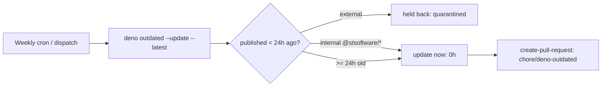

# Add release-age quarantine to Deno auto-update

## Summary

`deno-outdated.yml` ran `deno outdated --update --latest` weekly with **no
release-age gate**, so a freshly-published (and possibly hijacked) external
JSR/`@std` dependency could land in the auto-opened `chore/deno-outdated` PR
within the same weekly window — the exact exposure `VIBE_BUMP_QUARANTINE_HOURS`
(default 24h) is meant to close.

This change gates external dependency upgrades behind a 24h (`P1D`) quarantine
using Deno's native `--minimum-dependency-age` support, and records the same
floor in `deno.json` so the CLI honours it everywhere. Internal
`stSoftwareAU/*` deps are excluded (0h) so they still update immediately, per
the dependency-bump policy. Closes #64.

### Changes

- **`.github/workflows/deno-outdated.yml`** — the update step now runs
  `deno outdated --update --latest --minimum-dependency-age=P1D`.
- **`deno.json`** — declares a canonical `minimumDependencyAge` block:

  ```json
  "minimumDependencyAge": {
    "age": "P1D",
    "exclude": ["jsr:@stsoftware/*", "npm:@stsoftware/*"]
  }
  ```

  `age: "P1D"` is the ISO-8601  24h external floor; the `exclude` globs give
  internal `stSoftwareAU` Deno deps a 0h quarantine.

### Scope note

The crates.io ecosystem is **not** auto-bumped by this workflow (it has no
scheduled auto-update path), so it is out of scope here. Gating crates.io
updates would require its own mechanism and is left for a separate change.

## Deno regression avoided

Used Deno's native `--minimum-dependency-age` flag and the `deno.json`
`minimumDependencyAge` config rather than introducing Renovate/Dependabot
(Node-style tooling) into this Deno repo.

## Evidence

Backend/CI-only change — no web interface to screenshot. Verified via the
test suite and the local quality gate:



- `deno test --allow-read tests/deno_outdated_workflow_test.ts` — 8 passed.
- `deno test --allow-read tests/*.ts` — 162 passed.
- `./quality.sh` — passes cleanly (cargo + Deno lint/check/test).
- Confirmed `deno 2.8.2` accepts both the `--minimum-dependency-age` flag and
  the `minimumDependencyAge` config (`deno check` reports no error).

## Test Plan

Added two tests to `tests/deno_outdated_workflow_test.ts` (both fail against
the unfixed code, pass after the fix):

- *Deno Outdated workflow gates updates behind a release-age quarantine
  (Issue #64)* — asserts the update step passes `--minimum-dependency-age`
  with a window of at least 24h (`P1D` or `>= 1440` minutes).
- *deno.json declares a minimumDependencyAge quarantine with internal
  exclusions (Issue #64)* — asserts `minimumDependencyAge.age == "P1D"` and
  that `jsr:@stsoftware/*` and `npm:@stsoftware/*` are excluded.
