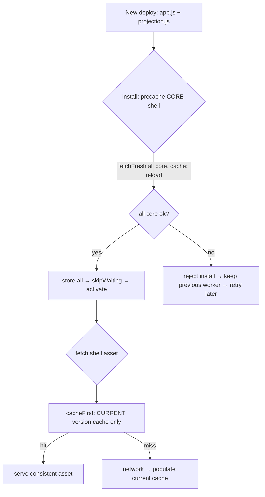

# Fix dashboard load regression: consistent, fresh service-worker app shell

## Summary

The dashboard could fail to load on PWA-installed devices with a red banner:

> Failed to load data: `GRQProjection.calculatePortfolioTargetWorking` is not a
> function …

`calculatePortfolioTargetWorking` is defined and exported in `docs/projection.js`
(added in #629/#640) and the deployed source is correct — the failure is a
**service-worker caching regression**, not a defect in the maths. The service
worker could end up caching or serving an **internally-inconsistent app shell**:
a fresh `app.js` (which calls the new helper) next to a stale or missing
`projection.js` (which lacks it). The page's cache-first fetch then served that
mismatched pair for the whole version's lifetime.

Three weaknesses in `docs/sw.js` allowed this, and all three are fixed:

1. **HTTP-cache staleness.** `precacheStaticAssets()` used `cache.add()`, which
   honours the browser HTTP cache. On a version bump GitHub Pages revalidated
   `index.html`/`app.js` but reused a stale `projection.js` from the HTTP cache.
   → Shell assets are now fetched with `new Request(asset, { cache: "reload" })`,
   bypassing the HTTP cache so a version bump always stores fresh bytes.
2. **Non-atomic precache.** Each asset was added individually with failures
   swallowed, and `install` called `skipWaiting()` even when the precache failed
   — so a half-updated shell could activate.
   → The **core** shell (`CORE_ASSETS`) is precached atomically: every core asset
   is fetched first and stored only if all succeed; a failed precache now
   **re-throws** so the install rejects and the browser keeps the previous
   consistent worker, retrying once the deploy propagates. Optional extras
   (`OPTIONAL_ASSETS`: icons, manifest, CDN) stay best-effort.
3. **Unscoped runtime lookups.** The fetch handler used `caches.match(request)`,
   which searches **every** cache, so a leftover old-version cache could serve a
   stale `projection.js` next to a fresh `app.js`.
   → A new `cacheFirst(request, cacheName)` helper reads only from the **current**
   version's cache.

`APP_VERSION` is bumped 1.1.30 → 1.1.31 (across `sw.js`, `sw-register.js`,
`index.html`, `trend.html`) so clients stuck on a bad cache reinstall the
corrected worker and re-precache a fresh, consistent shell.

`Closes #641.`

## Evidence

Service-worker behaviour is headless; the user-visible result is that the
dashboard loads (chart + data render, **no error banner**). Captured with
headless Chrome against the local `docs/` build:

Behaviour is locked in by tests that execute the **real** `docs/sw.js` code
against mocked Cache Storage / fetch / Request:

- `tests/sw_precache_reload_test.ts` — every shell asset is fetched with
  `cache: "reload"`; optional failures are tolerated; a non-ok **core** asset
  rejects the precache and caches nothing.
- `tests/sw_shell_consistency_test.ts` — a failed core asset rejects the install
  and never `skipWaiting`s; the fetch handler serves shell assets only from the
  current version's cache (never a leftover stale cache). Both reproduce #641 and
  fail against the pre-fix code.

## Test Plan

- Updated `tests/sw_precache_reload_test.ts` for the new **tiered** precache
  (core atomic / optional best-effort) — documented in-file as a deliberate
  business-logic change; 5 tests including the new core-rejection case.
- Added `tests/sw_shell_consistency_test.ts` (4 tests) covering atomic-core
  install, optional tolerance, no-skipWaiting-on-failure, and scoped fetch.
- Existing `tests/sw_precache_list_test.ts` (version alignment, now 1.1.31) and
  `tests/sw_pathname_guards_test.ts` still pass.
- Full Deno suite: `1232 passed | 0 failed`. `deno fmt --check`, `deno lint`,
  `deno check`, `markdownlint-cli2` and `cargo check` all clean.

## Files changed

- `docs/sw.js` — split `STATIC_ASSETS` into atomic `CORE_ASSETS` +
  best-effort `OPTIONAL_ASSETS`; `fetchFresh()` (cache: "reload"); atomic core
  precache; install re-throws on failure; scoped `cacheFirst()` helper.
- `docs/sw-register.js`, `docs/index.html`, `docs/trend.html` — `APP_VERSION`
  1.1.30 → 1.1.31.
- `tests/sw_precache_reload_test.ts`, `tests/sw_shell_consistency_test.ts` —
  behavioural tests.
- `CHANGELOG.md` — Fixed entry.
- `docs/evidence/issue-641-dashboard-loads.png` — screenshot evidence.
