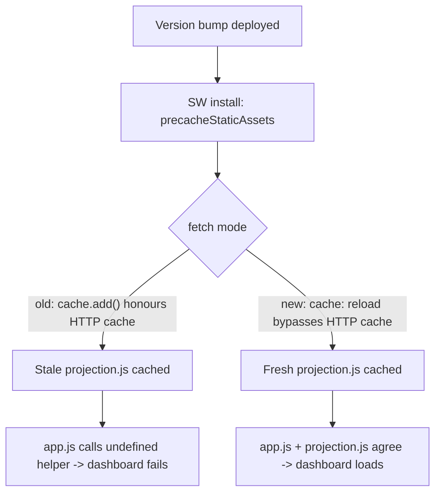

# Fix dashboard load regression: stale precached projection.js (Issue #641)

## Summary

The dashboard failed to load on devices with the PWA installed, showing:

> Failed to load data: GRQProjection.calculatePortfolioTargetWorking is not a
> function. (In 'GRQProjection.calculatePortfolioTargetWorking(this.buildPortfolioTargetStocks(), )',
> 'GRQProjection.calculatePortfolioTargetWorking' is undefined)

`calculatePortfolioTargetWorking` was added to `docs/projection.js` (and called
from `docs/app.js`) in #640/#629, and the source is correct — loading
`projection.js` in Node confirms `GRQProjection.calculatePortfolioTargetWorking`
is a function. The failure was a **service-worker caching regression**, not a
code defect in the helper.

`precacheStaticAssets()` populated the new versioned cache with a plain
`cache.add(asset)`. `cache.add()` issues an ordinary `fetch`, which honours the
browser HTTP cache. On a version bump, GitHub Pages revalidated
`index.html`/`app.js` (short-lived HTML caching) but let the `.js` shell files
be reused from the HTTP cache, so the new `grq-validation-static-v1.1.30` cache
was filled with a **stale `projection.js`** that pre-dated the new helper. The
fresh `app.js` then called a function the cached `projection.js` did not define,
and the dashboard's cache-first fetch served that stale file for the whole
version's lifetime.

**Fix:** `precacheStaticAssets()` now fetches each shell asset with
`new Request(asset, { cache: "reload" })`, bypassing the HTTP cache so a version
bump always caches fresh bytes. This mirrors the existing `cache: "no-store"`
pattern already used for the score index and per-day data in the same file.
Only `response.ok` responses are stored, so a transient 404/offline asset is
skipped (warned) rather than poisoning the cache. `APP_VERSION` is bumped
1.1.30 → 1.1.31 so clients reinstall the corrected worker and re-precache.

Closes #641.

## Evidence

No web UI screenshot: the regression only manifests with a stale HTTP-cached
shell asset, which cannot be reproduced in a headless screenshot (source always
loads cleanly), and Playwright MCP was unavailable this run. Evidence is the new
behavioural tests, which execute the **real** `precacheStaticAssets()` body
extracted from `docs/sw.js` against mocked `caches`/`fetch`/`Request`:

- Asserts every shell asset is fetched with `cache: "reload"` (the assertion
  that fails against the old `cache.add()` path, which never reaches `fetch`).
- Asserts the freshly fetched response is what gets stored.
- Asserts a non-ok (404) response is skipped, not cached.
- Asserts a fetch rejection is tolerated and the remaining assets still cache.

Full suite: `deno test --allow-read tests/*.ts` → **1227 passed, 0 failed**.
`deno fmt`, `deno lint`, `deno check` all clean. The existing
`sw_precache_list_test.ts` version-alignment guard confirms 1.1.31 is consistent
across `sw.js`, `sw-register.js` and `index.html`.

## Test Plan

- Added `tests/sw_precache_reload_test.ts` (4 tests) reproducing #641 — the
  reload-mode assertion fails against the pre-fix `cache.add()` code and passes
  after the fix.
- `tests/sw_precache_list_test.ts` — version alignment across SW/register/index
  (now 1.1.31).
- Full `deno test --allow-read tests/*.ts` suite green.

## Files changed

- `docs/sw.js` — `precacheStaticAssets()` fetches with `cache: "reload"`;
  `APP_VERSION` 1.1.30 → 1.1.31.
- `docs/sw-register.js`, `docs/index.html`, `docs/trend.html` — version refs
  bumped to 1.1.31.
- `tests/sw_precache_reload_test.ts` — new behavioural tests.
- `CHANGELOG.md` — Fixed entry.
