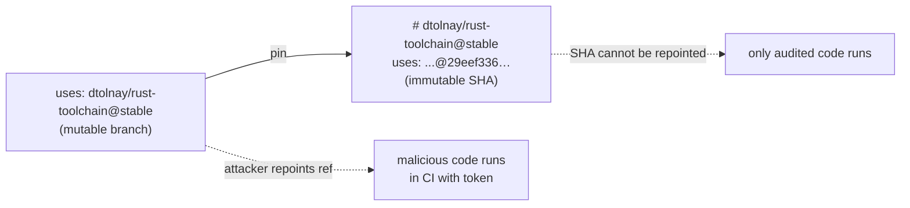

# PR Summary — Pin unpinned third-party GitHub Actions (Issue #65)

## Summary

`.github/workflows/ci.yml` and `.github/workflows/dependency-review.yml` pinned
their GitHub Actions to mutable tags/branches (`@stable`, `@v4`, `@v3`) instead
of 40-character commit SHAs. A mutable ref can be repointed at malicious code by
a compromised upstream account, which would then execute in CI with the
workflow token — most acutely the `dtolnay/rust-toolchain@stable` *branch* and
`codecov/codecov-action@v4` (codecov was the subject of a 2021 supply-chain
compromise). Every other workflow in the repo already pins to SHAs, so this was
a regression from the established convention.

This PR pins every action in both files to a full commit SHA with a
`# owner/action@version` comment above the `uses:` line — matching the exact
convention used by `deno-quality.yml`, `cargo-audit.yml`, `gitleaks.yml`, etc.
Reused the SHAs already trusted in the repo for `actions/checkout` (v4.2.2),
`dtolnay/rust-toolchain` (stable) and `codecov/codecov-action` (v4); resolved
fresh SHAs for the remaining first-party actions via the GitHub tags API.

Closes #65.

### Actions pinned

| Action | Version comment | SHA |
| --- | --- | --- |
| actions/checkout | v4.2.2 | `11bd71901bbe5b1630ceea73d27597364c9af683` |
| dtolnay/rust-toolchain | stable | `29eef336d9b2848a0b548edc03f92a220660cdb8` |
| actions/cache | v4.3.0 | `0057852bfaa89a56745cba8c7296529d2fc39830` |
| codecov/codecov-action | v4 | `b9fd7d16f6d7d1b5d2bec1a2887e65ceed900238` |
| actions/upload-artifact | v4.6.2 | `ea165f8d65b6e75b540449e92b4886f43607fa02` |
| actions/configure-pages | v4.0.0 | `1f0c5cde4bc74cd7e1254d0cb4de8d49e9068c7d` |
| actions/upload-pages-artifact | v3.0.1 | `56afc609e74202658d3ffba0e8f6dda462b719fa` |
| actions/deploy-pages | v4.0.5 | `d6db90164ac5ed86f2b6aed7e0febac5b3c0c03e` |
| actions/dependency-review-action | v4.9.0 | `2031cfc080254a8a887f58cffee85186f0e49e48` |

## Evidence

Backend/CI-config change — no web interface to screenshot. Verified via new
Deno tests that read and assert on the actual workflow YAML.



Test run:

```
ok | 9 passed | 0 failed   # ci_workflow_test.ts + dependency_review_workflow_test.ts
ok | 112 passed | 0 failed # full Deno suite
```

## Test Plan

Added (TDD — written failing first, then made to pass):

- `tests/ci_workflow_test.ts`
  - file exists and parses as valid YAML
  - every `uses:` is pinned to a 40-char commit SHA
  - no `uses:` line references the mutable `dtolnay/rust-toolchain@stable` branch
  - each pinned action carries a `# owner/action@version` comment above it
- `tests/dependency_review_workflow_test.ts`
  - file exists and parses as valid YAML
  - every `uses:` is pinned to a 40-char commit SHA
  - each pinned action carries a version comment above it

The SHA-pinning assertions failed against the unpinned workflows and pass after
the fix. `deno fmt`, `deno lint`, and `deno check` are clean; the full Deno test
suite (112 tests) passes.
