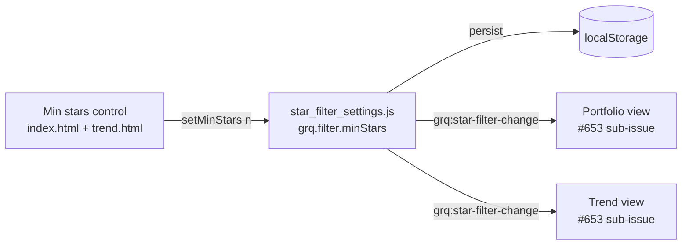

## Summary

Adds the **shared foundation** for an optional minimum-star-rating filter: a
compact control, a persisted cross-page setting, and the documented change-event
contract the two sibling #653 sub-issues will consume. This issue delivers the
control, the persistence, and the "Trend" button rename/layout only — it changes
**no** aggregate or chart maths. With the control left at its **All** default,
dashboard and Trend behaviour is byte-for-byte identical to before. Closes #654.

What changed:

- **New settings module `docs/star_filter_settings.js`** — mirrors
  `docs/chart_window_settings.js` / `docs/trend_settings.js`:
  - Namespaced `localStorage` key `grq.filter.minStars`, with
    `resolveStorage` / `safeGet` / `safeSet` helpers tolerating no-storage
    (private mode).
  - `normaliseMinStars()` coerces to `0` (= "All"/off) or whole stars `1`–`5`,
    defaulting to `0`.
  - Published on `globalThis.GRQStarFilter` with the accessor contract
    `getMinStars()` / `setMinStars(n)`.
  - `setMinStars(n)` persists the normalised value and dispatches a
    `grq:star-filter-change` `CustomEvent` on `window` (`event.detail.minStars`)
    — the documented integration surface the portfolio and Trend wiring
    sub-issues subscribe to.
- **Compact `Min stars` control on both pages** — a `<select>` reading
  `All / 1★+ … / 5★+` with an accessible name. On `docs/index.html` it rides
  inside the `.chart-heading-controls` row beside the Trend button and 90/180
  toggle; on `docs/trend.html` it sits in its own controls-row column. Both
  reflect and write the shared persisted key, so a choice on one page is shared
  with the other. Default is **All** (off).
- **Trend button rename + layout** — `#trendViewLink` now reads **Trend**
  (was `📈 Prediction Trend`); a small CSS rule keeps the select sized to its
  content so the whole portfolio controls row fits on one line on a 375px-wide
  (iPhone) viewport.
- **Wiring** — `docs/app.js` (`initStarFilterControl`) and `docs/trend.js`
  (`buildStarFilterControl`) restore the control from the shared setting and,
  on change, call `GRQStarFilter.setMinStars(...)`. Both are guarded so a
  missing control/helper degrades cleanly. No view re-renders on the event yet
  (that is the sibling sub-issues' job).

### Integration contract (consumed by the two sibling #653 sub-issues)

## Evidence

Both controls default to **All**, and the portfolio controls row (Trend button +
Min stars + 90/180 toggle + expand) fits on one line at a 375px-wide iPhone
viewport. Screenshots captured headlessly at 375 px:

## Test Plan

- **`tests/star_filter_settings_test.ts`** (new, modelled on
  `tests/chart_window_settings_test.ts`): default `0`, normalisation of
  out-of-range/junk values, round-trip persistence of each `0`–`5` threshold,
  no-storage / throwing-storage tolerance, and the accessor + change-event
  contract (`setMinStars` returns the normalised value and dispatches
  `grq:star-filter-change` with the new threshold).
- **`tests/dashboard_controls_test.ts`** (extended): Trend button reads `Trend`
  (old `📈 Prediction Trend` text gone); the `#starFilterSelect` control is
  present, carries an accessible name, defaults to **All**, and sits inside the
  `.chart-heading-controls` wrapper above the chart card.
- **`tests/star_filter_control_trend_test.ts`** (new): the same control is
  present on `docs/trend.html`, offers the `1★+`–`5★+` thresholds, defaults to
  **All**, and `star_filter_settings.js` loads before `trend.js`.
- Full suite: `deno test --allow-read tests/*.ts` → **1210 passed, 0 failed**;
  `deno lint` and `deno check` clean; `deno fmt` applied. No Rust files were
  touched.

## Security self-check

- No secrets or hidden files staged; only `docs/`, `tests/` and `README.md`
  changes plus two PNG screenshots.
- The control writes a single normalised integer (`0`–`5`) to `localStorage`;
  the read path normalises untrusted stored values and tolerates corrupt/absent
  storage without throwing. No new network, shell, SQL or HTML-injection
  surface — the select options are static literal markup.

### Deno regression avoided

No Node tooling introduced — the new module is a classic-script `docs/*.js`
file and its tests run under `deno test`, consistent with the existing settings
modules.
