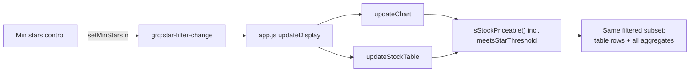

## Summary

Wires the optional minimum-star filter (foundation #654) into the **portfolio
view**. When a whole-star threshold is active, the dashboard now restricts both
the holdings table and **every** portfolio aggregate (chart performance line,
target dot, trend line, and the totals-row metrics) to stocks whose combined
star rating `avgStars` meets the threshold, and recomputes the aggregate over
that filtered subset. With the filter at **All/off** (the default), the view is
byte-for-byte identical to before. Closes #655.

The extra gate is the single source of truth `GRQProjection.meetsStarThreshold(avgStars, minStars)`
and is folded into the shared `isStockPriceable()` inclusion check — the same
gate that already applies the unpriceable (#289), low-volume (#577) and
negative-score (#627) exclusions — plus the target-dot input builder
(`buildPortfolioTargetStocks`), so the table and every aggregate are computed
from the **same** filtered set and cannot diverge. A no-rating stock
(`avgStars === null`) is excluded while the filter is on. Unlike the existing
exclusions (which strike a row through), star-filtered stocks are **hidden**
entirely from the holdings table, matching the acceptance criteria. The view
subscribes to `grq:star-filter-change` and re-renders the chart and table
without a page reload.

### Behaviour

## Evidence

Filter **off** (default, `All`) — full 21-stock holdings table, unchanged view:

Filter **≥4★** — table shows only the stocks rated 4★ or higher, and the chart
performance line, target dot and totals row all recompute over exactly that
subset:

Captured against the live dashboard (`docs/index.html`) served locally with the
shipped 2026-01-01 data: 21 rows with the filter off → 2 rated rows (+ totals)
at `4★+`, confirming the table and the recomputed aggregate agree.

## Test Plan

- **New** `tests/portfolio_star_filter_test.ts` — a mirror validator (same
  pattern as `portfolio_exclusion_test.ts`) that delegates to the real
  `docs/projection.js` kernels and asserts:
  - filter off ⇒ every stock shown and counted (unchanged);
  - an active threshold restricts the table and the aggregate to the **same**
    subset (table/aggregate agreement);
  - the aggregate and the target dot **recompute** over the filtered subset;
  - no-rating stocks are hidden from both the table and the aggregate;
  - the star gate composes with the existing unpriceable exclusion.
- **Extended** `tests/star_rating_test.ts` — added unit tests for the pure
  `GRQProjection.meetsStarThreshold` predicate (off includes all; at/above
  threshold included; below excluded; no-rating excluded while active).
- Full suite green: `deno test --allow-read tests/*.ts` → **1221 passed, 0
  failed**. `deno fmt`, `deno lint`, `deno check` all clean.

## Files changed

- `docs/projection.js` — new pure `meetsStarThreshold(avgStars, minStars)` kernel + export.
- `docs/app.js` — new `meetsStarFilter()`; folded into `isStockPriceable()`;
  hide star-filtered rows in `updateStockTable()`; pre-filter
  `buildPortfolioTargetStocks()`; subscribe to `grq:star-filter-change` to
  re-render.
- `tests/portfolio_star_filter_test.ts`, `tests/star_rating_test.ts` — tests.
- `README.md` — documented the portfolio filtering behaviour (#655).
