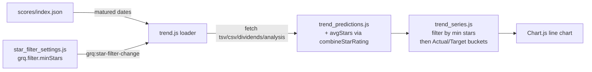

## Summary

Wire the optional minimum-star filter into the **Trend chart** (`docs/trend.html`),
the third sub-issue of milestone #653. The Trend pipeline now (a) joins each
matured date's star ratings into the prediction inputs and (b) when a threshold
is active, excludes stocks below it — and unrated stocks — **before** the
Actual/Target series are aggregated, so the trend lines recompute over the
qualifying subset. With the filter off (default **All**), the Trend chart is
byte-for-byte identical to today. Closes #656.

### What changed

- **Shared star-combination kernel.** Added
  `GRQProjection.combineStarRating(msStars, tipsStars)` to `docs/projection.js`
  as the single source of truth that turns the raw `MS` (1–5) and `Tips Stars`
  (1–10) columns into the 1–5 `avgStars` both views filter on. The portfolio
  view (`docs/app.js`) was refactored to delegate to this kernel too, so a
  stock's effective rating cannot drift between the two views.
- **Join star data into the pipeline.** `docs/trend_predictions.js` now parses
  the per-date analysis CSV (`scores/<YYYY>/<Month>/<DD>-analysis.csv`) via a
  new quote-and-newline-aware `parseCsvRecords` tokeniser — required because the
  CSV quotes currency columns that sit *before* the rating columns and wraps
  some headings across physical lines. `parseAnalysisCsv` returns a
  `{ ticker: avgStars }` map; `resolvePredictionStocks` / `buildPrediction`
  thread `avgStars` onto each stock (null when unrated or the file is absent).
- **Filter before aggregation.** `docs/trend_series.js` gained
  `filterStocksByStars(stocks, minStars)`; `buildMaturedTrendSeries` takes an
  optional `minStars` and filters each date's stocks (via the shared
  `meetsStarThreshold` gate) before the Actual/Target means are computed. At
  `0` (All) every stock is kept, so the series is unchanged.
- **Live control wiring.** `docs/trend.js` fetches the analysis CSV per matured
  date (tolerating a 404), keeps the resolved predictions in memory, reads the
  threshold from the shared `GRQStarFilter` accessor, and subscribes to the
  `grq:star-filter-change` event to re-filter and re-render **without a
  re-fetch**. A threshold changed on the portfolio page is reflected here on
  return.

### Deno regression avoided

- Kept all parsing in Deno-native `globalThis`-published modules and exercised
  the new helpers with `deno test`; no Node bundler, test runner, or
  `package.json` was introduced. The one-off screenshot used `playwright-core`
  installed in `/tmp` only, leaving this Deno repo untouched.

## Evidence

UI change — captured against a local server over the real shipped score data
(167 matured dates carry analysis CSVs). With the **Min stars** control at
**All** the full trend renders; switching to **4★+** recomputes the Actual and
Target lines live (no reload) over only the qualifying stocks, and dates lacking
an analysis CSV drop out.

| All (filter off) | 4★+ (filter active) |
| --- | --- |
|  |  |

## Test Plan

All `deno test` (1240 passed) plus `deno fmt --check`, `deno lint`, `deno check`
pass. Tests added/extended:

- `tests/star_rating_test.ts` — `combineStarRating` happy path, single-rating
  fallback, string-cell coercion, and out-of-range/missing handling.
- `tests/trend_predictions_test.ts` — `parseAnalysisCsv` combines `MS`/`Tips
  Stars` past quoted commas; `parseCsvRecords` keeps a multi-line quoted header
  as one record; missing-file tolerance; `avgStars` join onto each stock.
- `tests/trend_series_test.ts` — `filterStocksByStars` off/active behaviour and
  `buildMaturedTrendSeries` filtered aggregation per bucket (off ⇒ unchanged,
  active ⇒ recomputed subset, a high threshold can empty a date out).
- `tests/trend_view_wiring_test.ts` — end-to-end pipeline proof that with the
  filter off, attaching ratings (or having no analysis CSV) yields the same
  series as before, and an active threshold recomputes over the subset; plus the
  `star_filter_settings.js`-before-`trend.js` load order.
