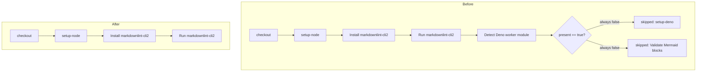

## Summary

Removed the dead "optional Mermaid validation" block from the `markdownlint`
job in `.github/workflows/markdown-lint.yml`. The three steps —
`Detect Deno worker module`, the conditional `denoland/setup-deno`, and
`Validate Mermaid blocks` — were a cross-repo template artefact: they gate on
`worker/deno/mod.ts`, a path that does not exist anywhere in this repository.
The detect step always emitted `present=false`, so the two guarded steps could
never run. The `markdownlint` job now ends cleanly after `Run markdownlint-cli2`.

This keeps the CI configuration honest about what it actually executes and
removes a latent footgun: if `worker/deno/mod.ts` were ever added for an
unrelated reason, an unreviewed `deno run` step would have silently activated.

Closes #665.

## Evidence

This is a CI-configuration-only change — no Rust or Deno source code is
touched, so there is no web interface to screenshot and no unit function to
exercise. Verification performed:

- Confirmed there is no `worker/` directory in the repository (the detect step
  could only ever produce `present=false`).
- Confirmed no remaining references to `detect-deno` or `worker/deno` anywhere
  under `.github/`.
- Validated that the edited workflow still parses as valid YAML
  (`yaml.safe_load` → `YAML OK`).

### Job structure before/after

## Test Plan

No automated tests apply to a workflow-YAML deletion. Manual verification:

- `python3 -c "import yaml; yaml.safe_load(open('.github/workflows/markdown-lint.yml'))"` → `YAML OK`
- `grep -rn "detect-deno\|worker/deno" .github` → no matches
- `ls worker` → no such directory
