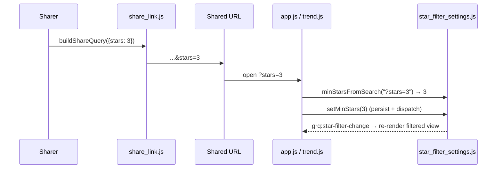

## Summary

The footer **🔗 Share** deep-link omitted the shared minimum-star filter, so a
link built while a 1–5 star filter was active reproduced the recipient's own
default (All) instead of the sharer's filtered view. This wires the star filter
through the share flow in both directions. Closes #666.

- **Emit on share** — `buildShareQuery` (`docs/share_link.js`) now appends
  `stars=<1..5>` when a forced threshold is set. `0` ("All") is the default and
  is emitted by absence, keeping unfiltered links clean; out-of-range values are
  dropped. `shareState()` in `docs/app.js` supplies the live threshold from
  `GRQStarFilter.getMinStars()`.
- **Read on load** — a new pure helper `GRQStarFilter.minStarsFromSearch(search)`
  (`docs/star_filter_settings.js`) parses `?stars=`, returning `0..5` for a valid
  value or `null` for absent / blank / out-of-range input. Both the portfolio
  (`docs/app.js`) and Trend (`docs/trend.js`) star-filter controls apply it on
  init via the normal `setMinStars` path, so a shared link reproduces the
  filtered view and every view stays in sync.

Because the star filter is the **shared, persisted** setting (`grq.filter.minStars`),
a supplied param is applied and persisted (unlike the transient `?theme=`/`?window=`
overrides). An absent or invalid `?stars=` leaves the saved choice untouched, so
existing behaviour is unchanged when the param is missing.

## Evidence

This is a deep-link serialisation/parsing change with no new visual element — the
on-screen result of `?stars=3` is identical to a user manually selecting "3★+" in
the existing, unchanged star-filter control. Playwright MCP was unavailable in
this environment, so verification is via the unit tests below; the dashboard was
served locally and confirmed to load `share_link.js`, `star_filter_settings.js`
and the `#starFilterSelect` control.

## Test Plan

- `tests/share_link_test.ts`:
  - `buildShareQuery emits ?stars for a forced 1..5 filter (issue #666)`
  - `buildShareQuery omits ?stars for the 0 (All) default`
  - `buildShareQuery drops an out-of-range ?stars value`
  - `buildShareQuery places ?stars after ?window and before ?fullscreen`
- `tests/star_filter_settings_test.ts`:
  - `minStarsFromSearch reads a forced 0..5 ?stars value`
  - `minStarsFromSearch trims surrounding whitespace`
  - `minStarsFromSearch returns null when the param is absent`
  - `minStarsFromSearch returns null for out-of-range / junk values`
  - `minStarsFromSearch distinguishes a forced All (0) from absence`
- `tests/deeplink_docs_test.ts` — README lead-in count updated to **ten**
  documented parameters (now includes `?stars=`); existing assertion passes.
- Full Deno suite: `deno test --allow-read tests/*.ts` → **1249 passed, 0 failed**.
