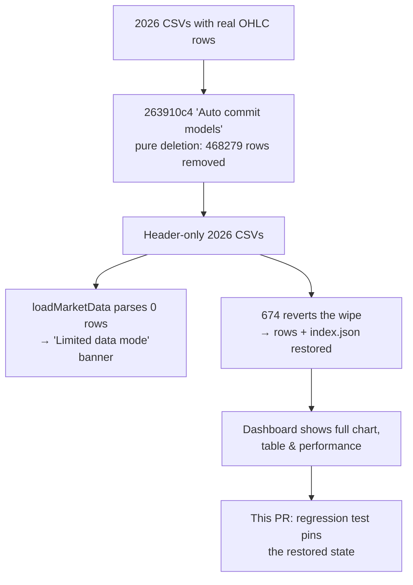

# Restore the empty 2026 market-data CSVs so the dashboard exits Limited-data mode

## Summary

Every 2026 market-data CSV under `docs/scores/2026/` had been committed as a
**header-only** file — the column header (`date,ticker,high,low,open,close,
split_coefficient`) with zero OHLC data rows. When `docs/app.js
loadMarketData()` parsed one it found 0 rows, set `this.marketData = {}`, and the
dashboard rendered the **"Limited data mode"** banner with no performance or
trend data. This affected **161 / 161** 2026 day files (2025 = 0 / 187, 2024 =
0 / 6), confirming a clean 2025→2026 regression boundary.

**Root cause — an accidental automated wipe, not a generator bug.** Git history
shows the 2026 CSVs originally carried real OHLC data and were then emptied by a
single automated commit, `263910c4` ("Auto commit models", author `scorer 3`).
That commit is **pure deletion** across `docs/scores/2026/` — `git show
263910c4 --numstat` reports **0 rows added, 468 279 rows deleted** — e.g.
`docs/scores/2026/March/30.csv` went from **1259** data rows in `263910c4^` to
**0** at `263910c4`, leaving only the header line. The market-data generator
(`create_market_data_csv` / `create_market_data_long_csv` in `src/utils.rs`) is
**not** at fault: it was never re-run to produce header-only output; an
unrelated batch commit truncated the already-good files. This is why
`is_market_data_csv_empty` (`src/utils.rs:54`) flags every 2026 day file.

**Fix.** The data itself was restored on the milestone base by **#674**
(PR #677, commit `1100a6ab`), which reverted the accidental `263910c4` wipe and
recovered the price rows and matching `index.json` performance figures from the
pre-wipe parent. This PR completes the #672 deliverables on top of that restore:

- **Pins the restored state with a regression test**
  (`tests/regression_2026_market_data_test.rs`) so the symptom can never
  silently recur via the same code path.
- **Documents the exact, evidence-backed root cause** (the `263910c4` wipe)
  rather than the originally-hypothesised generator bug.
- **Captures dashboard evidence** for the symptom date.

After the restore, all 161 2026 day files carry data
(e.g. `docs/scores/2026/March/30.csv`: 1 line → 1260 rows), and
`docs/scores/index.json` shows non-zero performance for every affected date —
e.g. `2026-03-30`: `performance_90_day` 0 → **12.12%**,
`performance_annualized` 0 → **60.78%**, 20 included stocks. The dashboard loads
full market data with **no** "Limited data mode" banner.

Closes #672.

### Scope notes

- The market-data restore (`docs/scores/2026/**/*.csv` and
  `docs/scores/index.json`) already landed on the milestone base via #674, so
  this PR adds only the regression test, the root-cause documentation, and the
  screenshot evidence — it does not re-touch the restored data.
- The three quality-gate forms that prevent silent recurrence are tracked
  separately under #671 (the `#674` market-data presence gate is already on the
  milestone base); this sub-issue is the data-restoration + root-cause-diagnosis
  half.

## Evidence

Backend/data change verified by the Rust test suite plus a dashboard screenshot.

Dashboard at `index.html?date=2026-03-30` after restoration — full performance
chart, market-comparison cards (SP500 +17.3%, NASDAQ +24.2%, Russell 2000
+24.7%), and the complete stock table, **no "Limited data mode" banner**:

Screenshot captured with the headless browser against a local
`python3 -m http.server` serving `docs/`.

## Test Plan

- Added `tests/regression_2026_market_data_test.rs` (reads the committed CSVs
  the same way the frontend `loadMarketData()` and backend
  `read_market_data_from_csv` do, so each assertion fails against the unfixed,
  header-only data and passes once the rows are restored):
  - `symptom_date_csv_is_not_header_only` — `docs/scores/2026/March/30.csv` is no
    longer header-only.
  - `restored_2026_csvs_have_real_ohlc_rows` — the symptom date plus a second
    2026 date parse to > 0 close prices, all positive.
  - `symptom_date_csv_carries_the_expected_ticker` — the `NYSE:SITC` series is
    present after restoration.
- `cargo test --all-targets --all-features`: all suites pass, including the new
  regression tests.
- `cargo fmt --all -- --check` and
  `cargo clippy --tests --all-features -- -D warnings -D clippy::uninlined_format_args`
  clean.
- `deno test --allow-read tests/*.ts`: **1266 passed, 0 failed** — including the
  `#674` `market_data_presence_test.ts` gate and the `#673` limited-data smoke
  test, both of which independently confirm the 2026 data is restored.
