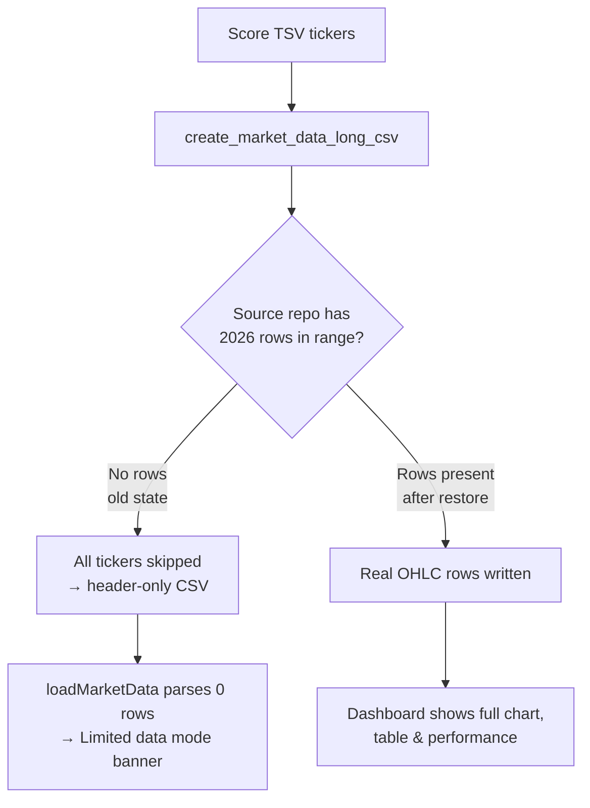

# Restore the empty 2026 market-data CSVs so the dashboard exits Limited-data mode

## Summary

Every 2026 market-data CSV under `docs/scores/2026/` had been committed as a
**header-only** file — the column header (`date,ticker,high,low,open,close,
split_coefficient[,volume]`) with zero OHLC data rows. When `docs/app.js
loadMarketData()` parsed one it found 0 rows, set `this.marketData = {}`, and the
dashboard rendered the **"Limited data mode"** banner with no performance or
trend data. This affected **161 / 161** 2026 day files (2025 = 0 / 187, 2024 =
0 / 6), confirming a clean 2025→2026 regression boundary.

**Root cause.** The market-data generator is not broken. `create_market_data_long_csv`
(`src/utils.rs`) reads OHLC rows from the share-price source repository
(`MARKET_DATA_BASE_PATH = ../GRQ-shareprices2026Q2`), filters them to the score
date's 180-day window, and writes one row per ticker-day. When a ticker has **no
rows in range** it is skipped by design — so when the source repository carried
**no 2026 data at the time the 2026 CSVs were first generated**, every ticker was
skipped and only the header line was written and committed. The source repository
now contains 2026 OHLC data (through 2026-06-29), so the files simply needed
regenerating.

**Fix.** Ran the existing `--regenerate-empty` path
(`./target/release/grq-validation --docs-path docs --regenerate-empty`), which
selects exactly the score files whose market CSV is missing or header-only
(via `is_market_data_csv_empty`), rewrites each with real OHLC rows, and
recomputes `docs/scores/index.json`. All 161 files now carry data
(e.g. `docs/scores/2026/March/30.csv`: 1 line → 1260 rows), and the dashboard
loads full market data with no Limited-data banner.

`docs/scores/index.json` now shows non-zero performance for the affected dates —
e.g. `2026-03-30`: `performance_90_day` 0 → **12.12%**, `performance_annualized`
0 → **60.78%**, 20 included stocks.

Closes #672.

### Scope notes

- Only `docs/scores/2026/**/*.csv` (market data) and `docs/scores/index.json`
  changed, plus the new regression test and screenshot. The dividend CSVs
  (`*-dividends.csv`) and TSVs are untouched: the batch path would have rewritten
  the dividend CSVs too, but the dividend source repo (`../GRQ-dividends`) is not
  present in this environment, so those regenerated files were reverted to keep
  the committed dividend data intact. The Rust performance calc reads dividend
  data from the source repo (not the committed CSV), so reverting them has no
  effect on the restored market data.
- The three quality-gate forms that prevent silent recurrence are tracked
  separately under #671 and are intentionally **not** implemented here; this
  sub-issue is the data-restoration + generator-diagnosis half.

## Evidence

Dashboard at `index.html?date=2026-03-30` after restoration — full performance
chart, market-comparison cards, and the complete stock table (with dividends),
**no "Limited data mode" banner**:

Screenshot captured with the headless Chromium shell against a local
`python3 -m http.server` serving `docs/`.

## Test Plan

- Added `tests/regression_2026_market_data_test.rs`:
  - `symptom_date_csv_is_not_header_only` — `docs/scores/2026/March/30.csv` is no
    longer header-only (fails against the unfixed, header-only data).
  - `restored_2026_csvs_have_real_ohlc_rows` — the symptom date plus a second
    2026 date parse to > 0 close prices, all positive.
  - `symptom_date_csv_carries_the_expected_ticker` — the `NYSE:SITC` series is
    present after restoration.
- `cargo test --all-targets --all-features`: all suites pass (88 unit + the new
  regression tests).
- `cargo fmt --all -- --check` and `cargo clippy --all-targets --all-features
  -- -D warnings` clean.
- The Deno portion of `quality.sh` could not run — `deno` is not installed in
  this environment — but no TypeScript files were changed.
