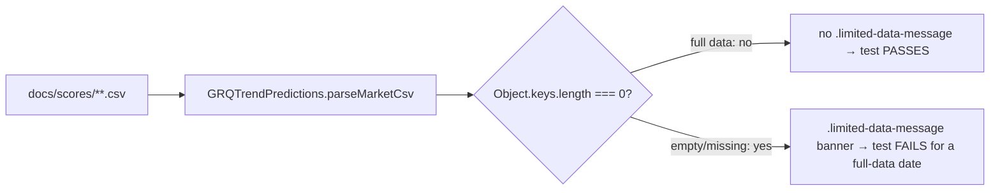

# Quality gate: dashboard "Limited data mode" smoke test

## Summary

Adds an automated smoke test that **fails** when the GRQ Validation dashboard
would fall into *Limited data mode* — i.e. when the `.limited-data-message`
("Limited data mode") banner is rendered for a date that should have full
market data. None of the existing dashboard tests assert that real market data
actually renders, which is why the #671 regression (a missing/empty
`scores/<date>.csv`) shipped green. This is quality-gate **form 1 of 3** from
issue #671. Closes #673.

The dashboard's banner decision lives in `GRQValidator.updateDisplay()`
(`docs/app.js:1423-1425`):

```js
if (!this.marketData || Object.keys(this.marketData).length === 0) {
    // insert <div class="alert alert-warning limited-data-message mb-3">
    //   <strong>Limited data mode.</strong> ...
}
```

`this.marketData` is built by `GRQValidator.loadMarketData()`. The shared
kernel `GRQTrendPredictions.parseMarketCsv()` (`docs/trend_predictions.js`)
mirrors that exact parse and is already used by the kernel tests, so the smoke
test drives the **real** parser over the **real** published
`docs/scores/**` CSVs rather than a reimplementation that could drift.

### How the gate works



The positive test dynamically selects the published date with the most market
tickers (a date that unambiguously has full data) and asserts the banner is
**absent**. The negative-control test feeds a header-only / empty / null CSV
(the exact #671 shape) and asserts the banner **is** rendered, so the gate
cannot pass vacuously.

## Evidence

Test-only change — no dashboard UI was modified, so there is no visual diff to
screenshot (Playwright MCP was unavailable in this environment). Verified
behaviour instead:

- New suite passes:

  ```
  running 3 tests from ./tests/dashboard_limited_data_smoke_test.ts
  dashboard smoke: a date with full market data does NOT show the limited-data banner ... ok
  dashboard smoke: an empty/missing market CSV DOES show the limited-data banner (negative control) ... ok
  dashboard smoke: banner is rendered at most once (no duplicate on re-render) ... ok
  ok | 3 passed | 0 failed
  ```

- **Gate proven to fail on the regression**: simulating the #671 state (the
  fullest date's CSV becomes header-only) flips `parseMarketCsv` to an empty
  map, so `shouldShowLimitedDataBanner` returns `true` and the positive test's
  `assertEquals(..., false)` fails — confirming a real gate, not a vacuous pass.

- Full Deno suite green: `deno test --allow-read --allow-env tests/*.ts` →
  `1252 passed | 0 failed`. `deno fmt --check`, `deno lint`, and
  `deno check` all clean; `markdownlint-cli2` reports 0 errors.

### CI wiring

No workflow edit was required: `deno-quality.yml` already runs
`deno test ... tests/*.ts` on every PR, and `quality.sh` runs
`deno test --allow-read tests/*.ts` locally, so the new `tests/*.ts` file is
picked up automatically and runs on every PR touching `docs/`.

## Test Plan

- Added `tests/dashboard_limited_data_smoke_test.ts`:
  - `a date with full market data does NOT show the limited-data banner` —
    parses the fullest published market CSV with the real kernel, asserts the
    `.limited-data-message` selector and "Limited data mode" text are absent.
  - `an empty/missing market CSV DOES show the limited-data banner` — header-only,
    empty-string, and `null` market data all render the banner (negative control).
  - `banner is rendered at most once` — mirrors the existing-message guard in
    `updateDisplay()` so re-render never stacks duplicate banners.
- Updated `README.md` Testing section to document the new gate.
