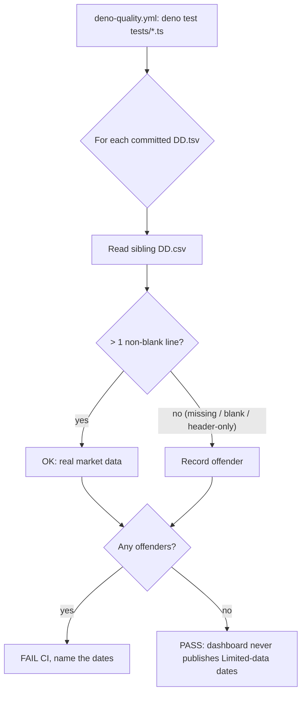

# PR Summary — Issue #674

## Summary

Adds the data-presence quality gate (form 2 of 3 from #671) so the dashboard can
never again publish a prediction date that renders in **Limited data mode**, and
restores the data that the gate exists to protect.

- **Gate** (`tests/market_data_presence_test.ts`): a Deno test that iterates
  every committed `docs/scores/**/DD.tsv` and asserts the sibling `DD.csv`
  **exists and carries data rows beyond the header** (non-blank). It **fails**
  on header-only / empty / missing CSVs and names each offending date. The
  empty-detection logic mirrors the `> 1 non-blank line` rule of
  `src/utils.rs::is_market_data_csv_empty`, so a bare-header CSV — the exact
  #671 failure — is treated as missing rather than passing a naive
  file-existence check.
- **Wiring**: the file is auto-discovered by `deno-quality.yml`'s
  `deno test ... tests/*.ts` step, which runs on every PR — the lowest-friction
  path called for in the issue. No workflow change was needed.
- **Restore**: the gate was red on the incoming tree because a stray
  `Auto commit models` (`263910c4`) had reduced all **161** `docs/scores/2026/`
  CSVs to a bare header row (and zeroed their `index.json` performance figures).
  Per the issue's ordering note ("merge them together, so CI goes green on a
  fixed tree"), this PR reverts exactly those 162 files to their pre-wipe parent
  (`cf2054d6`), recovering the real price rows. This turns the gate green and
  lifts the dashboard out of Limited-data mode (restores the data tracked by
  #672).

Closes #674.

### Deno regression avoided

The gate is implemented as a native Deno test (`deno test`), not a new Node
tool — it slots straight into the existing `deno-quality.yml` test step.

## Evidence

Backend/data + test change — no web UI was altered, so no screenshot. Verified
by running the gate against both the broken and the restored tree.

**Before the restore** (gate correctly red, naming offenders):

```
data-presence gate: every committed prediction date has a non-empty sibling market-data CSV => ./tests/market_data_presence_test.ts
  ...
  docs/scores/2026/May/29.csv (header-only/empty)
  [Diff] Actual / Expected
-   161
+   0
FAILED | 5 passed | 1 failed
```

**After the restore** (gate green):

```
running 6 tests from ./tests/market_data_presence_test.ts
isMarketDataCsvEmpty: header-only CSV is treated as empty ... ok
isMarketDataCsvEmpty: missing CSV (null) is treated as empty ... ok
isMarketDataCsvEmpty: blank/whitespace CSV is treated as empty ... ok
isMarketDataCsvEmpty: CSV with data rows beyond the header is NOT empty ... ok
isMarketDataCsvEmpty: trailing blank lines do not count as data rows ... ok
data-presence gate: every committed prediction date has a non-empty sibling market-data CSV ... ok
ok | 6 passed | 0 failed
```

Full Deno suite: `ok | 1258 passed (79 steps) | 0 failed`. The Rust suite is
unaffected — no Rust source changed, and the Rust tests reference 2025 score
files / temp fixtures, not the restored 2026 data.



## Test Plan

Added `tests/market_data_presence_test.ts`:

- `isMarketDataCsvEmpty` unit tests — header-only, missing (`null`),
  blank/whitespace, header-with-trailing-blanks (all empty), and a CSV with a
  data row (not empty). These pin the `> 1 non-blank line` contract independently
  of the on-disk tree.
- `data-presence gate` — scans every committed `docs/scores/**/DD.tsv`, fails and
  lists every date whose sibling CSV is empty/header-only/missing, and guards
  against passing vacuously by asserting many prediction TSVs are found.

This regression test fails against the pre-restore tree (the 161 header-only
2026 CSVs) and passes after the restore, proving it is a genuine gate.
