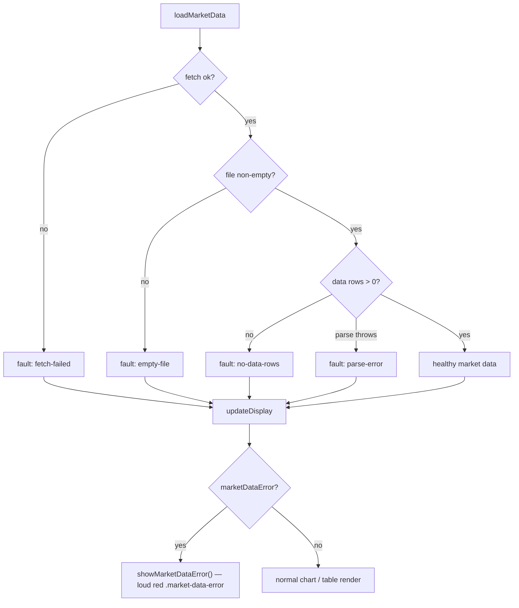

# Make `loadMarketData()` fail loudly instead of silently degrading

## Summary

The dashboard used to set `this.marketData = null` on **every** market-data
failure path and then quietly render the soft amber **"Limited data mode"**
placeholder, so a broken data pipeline looked just like a normal-but-sparse
dashboard and could ship unnoticed.

`GRQValidator.loadMarketData()` (`docs/app.js`) now classifies each failure as a
**data fault** and records it on `this.marketDataError`:

| Path | Reason code |
| --- | --- |
| All fetch attempts fail | `fetch-failed` |
| File empty / whitespace-only | `empty-file` |
| Header-only / zero data rows (parses to no usable rows) | `no-data-rows` |
| Exception while parsing | `parse-error` |

`updateDisplay()` checks `this.marketDataError` **before** the limited-data
branch and renders a **visible, distinct loud error state** via the new
`showMarketDataError()` — the red `#error` alert carrying stable DOM hooks the
dashboard smoke test can assert on:

- class `.market-data-error`
- `data-market-data-state="error"`
- `data-market-data-reason="<reason>"`

A `null`/empty `marketData` with **no** recorded fault (e.g. initial load or a
genuinely-absent-but-expected date) still shows the soft placeholder, so the
loud error stays **actionable rather than noisy** — broken data is distinguished
from an expected sparse view. `hideMessages()` clears the fault hooks on a
recovered healthy render so no stale error state lingers.

The shared kernel `GRQTrendPredictions.classifyMarketLoad()`
(`docs/trend_predictions.js`) mirrors this exact fault classification — just as
`parseMarketCsv` already mirrors `loadMarketData()`'s inline parse — and is the
unit the tests drive over the real on-disk CSVs.

Closes #675

## Evidence

This is a UI change, but **Playwright MCP was unavailable in this environment**
(no connected browser / chromium binary), so a screenshot could not be captured.
Instead the rendered behaviour is verified by the new render-mirror tests and
documented below.

### State flow



### Rendered loud-error markup (from `showMarketDataError()`)

```html
<div id="error" class="alert alert-danger market-data-error"
     data-market-data-state="error" data-market-data-reason="no-data-rows">
  <i class="fas fa-triangle-exclamation"></i>
  <strong>Market data unavailable — data fault.</strong>
  Market data file has a header but no data rows. This is a data fault.
  <br><br>
  <small>This dashboard intentionally fails loudly rather than showing partial
  results that could be mistaken for a healthy view.
  Reason code: <code>no-data-rows</code>.</small>
</div>
```

Dynamic values are passed through the existing `escapeHtml()` helper before
landing in `innerHTML` (defence in depth — the `parse-error` message embeds a JS
error string).

## Test Plan

New `tests/market_data_fail_loud_test.ts` drives the real
`GRQTrendPredictions.classifyMarketLoad()` kernel and a DOM-stand-in render
mirror:

- `classifyMarketLoad: a date with full market data is healthy (ok)` — real
  `docs/scores/**` CSV with the most tickers classifies as `ok`.
- `classifyMarketLoad: a failed fetch is a loud, distinct fault` — `fetch-failed`.
- `classifyMarketLoad: an empty file is a loud, distinct fault` — `""`, `"   "`,
  `"\n\n"`, `null` all → `empty-file`.
- `classifyMarketLoad: a header-only / zero-row CSV is a loud, distinct fault` —
  the exact #671 silent-degradation shape → `no-data-rows`.
- `classifyMarketLoad: a real fault is never silently treated as healthy` —
  rows with no ticker → fault, not a vacuous `ok`.
- `classifyMarketLoad: distinct reasons keep the fault actionable` — three fault
  shapes yield three distinguishable reason codes.
- `render: a data fault shows the loud error hook, not Limited data mode` —
  asserts the `.market-data-error` / `data-market-data-state` hooks render and
  the soft "Limited data mode" text does not.
- `render: healthy data leaves the loud error hook absent`.

All Deno tests pass: `deno test --allow-read tests/*.ts` → **1266 passed, 0
failed**. The sibling smoke test
(`tests/dashboard_limited_data_smoke_test.ts`) is untouched and still green.

Deno `fmt`, `lint`, and `check` are clean across the changed files; README
markdown passes `markdownlint-cli2`. The Rust suite is unaffected (JS-only
change).
