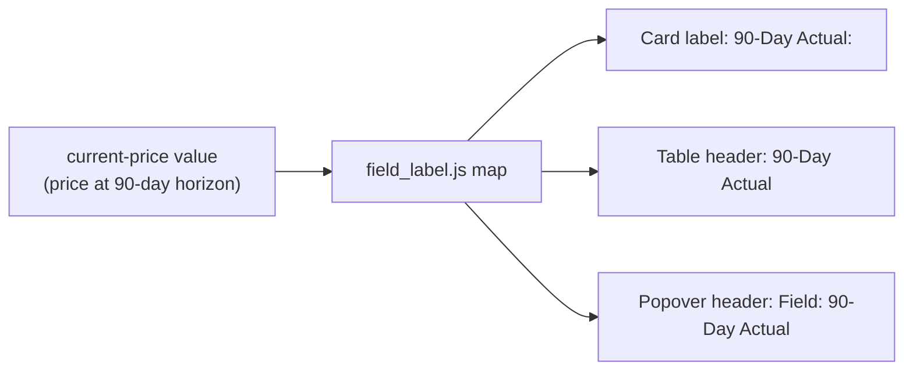

## Summary

Renamed the user-facing dashboard field **"90-Day Price"** to **"90-Day Actual"**
as requested in the issue (the circled label in the "Detailed Information"
panel). The field shows the price at the 90-day validation horizon, so
"90-Day Actual" reads naturally as the actual outcome against the neighbouring
**"90-Day Target"**. Title Case ("Actual") was used to match the surrounding
labels ("90-Day Target", "90-Day Price").

The rename covers every user-facing occurrence of the label so the UI stays
consistent:

- `docs/field_label.js` — the central `current-price` → label map (drives the
  "show the working" popover header).
- `docs/app.js` — detail-card label, sortable table header, popover titles, and
  the "90-Day Actual working:" / Gain-Loss working popover text.
- `docs/index.html` — the static table column header.
- `docs/projection.js` and `README.md` — documentation/comment references.

The internal `data-field="current-price"` id is deliberately **unchanged** —
only the human-readable label moved.

Closes #683.

## Evidence

Playwright MCP was unavailable in this environment, so no browser screenshot
could be captured. The change is a pure label rename verified by:

- The updated Deno unit tests in `tests/show_working_field_label_test.ts`
  (`fieldLabel("current-price")` now returns `"90-Day Actual"`; the working
  header now reads `Field: 90-Day Actual`).
- The served static header confirmed via `curl`:
  `<th>90-Day Actual</th>` renders in `docs/index.html`.
- Full Deno suite: **1266 passed, 0 failed**.

## Test Plan

- Updated `tests/show_working_field_label_test.ts` to assert the new label
  (`current-price` → `"90-Day Actual"`) in three places: the direct mapping
  test, the documented-labels table, and the `workingHeader` expectation. These
  assertions changed because the display label itself changed — the internal
  field id is untouched.
- Ran `deno test --allow-read tests/*.ts` → 1266 passed, 0 failed.
- Ran `deno fmt --check`, `deno lint`, and `deno check` → all clean.
