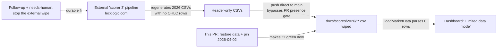

# Fix REGRESSION: 2026 market-data CSVs re-wiped, dashboard stuck in "Limited data mode" (Issue #685)

## Summary

The dashboard at
`https://stsoftwareau.github.io/GRQ-validation/?date=2026-04-02` rendered the
**"Limited data mode"** banner with no performance or trend data. The reported
date's market-data file, `docs/scores/2026/April/02.csv`, was committed as a
**lone header row** (`date,ticker,high,low,open,close,split_coefficient`, 50
bytes) with zero OHLC rows. `docs/app.js loadMarketData()` parsed 0 rows, set
`this.marketData = {}`, and the page degraded to the placeholder banner.

**Why it "constantly fails" — a recurring external wipe.** This is the same
class of regression restored under #672 / #674, and it came back. Git history
shows a fresh automated push, `642eb620` ("Auto commit models", author
`scorer 3 <scorer-3@lecklogic.com>`), that is a **pure deletion** across
`docs/scores/2026/`: `git show 642eb620 --numstat` reports **0 rows added,
205 488 deleted** over **161 files** — e.g. `April/02.csv` went from **1220**
data rows at `642eb620^` to **0**. That external pipeline regenerates the 2026
CSVs, finds no OHLC rows for those dates, writes header-only files, and pushes
**directly to `main`** — bypassing the PR-only data-presence gate (#674) that
would otherwise block it.

This PR restores the data so the dashboard works again now, and pins the exact
symptom date with a regression test. The durable prevention (stopping the
external `scorer 3` pipeline from pushing header-only CSVs) is outside this
repository and is escalated for human action — see **Durable fix / follow-up**.

Fixes #685.

## What changed

- **Restored** all 161 market-data CSVs under `docs/scores/2026/` and the
  matching `docs/scores/index.json` performance figures from the pre-wipe parent
  commit `642eb620^`. For `2026-04-02`: `index.json` `performance_90_day`
  `0 → 26.69%`, `performance_annualized` `0 → 163.99%`; the CSV `1 → 1221`
  lines (1220 OHLC rows).
- **Extended** `tests/regression_2026_market_data_test.rs` to pin the issue's
  exact date — a new `issue_685_symptom_date_csv_carries_real_ohlc_rows` test
  plus `2026-04-02` added to the restored-CSV table — so a future re-wipe of
  `April/02.csv` fails the build instead of silently degrading the page.
- **CHANGELOG** entry under `Fixed` documenting the recurrence and its cause.

## Recurrence, at a glance

## Evidence

Playwright MCP was unavailable in this run, so no browser screenshot could be
captured. The change is **data-only** (CSV/JSON restore) with no UI-code change,
so behaviour is verified through the served data and the test suite:

- **Data-presence gate** (`tests/market_data_presence_test.ts`) — **failed**
  before the restore, naming 160 header-only CSVs (including `2026/April/02`);
  **passes** after (`6 passed | 0 failed`).
- **Rust regression** (`tests/regression_2026_market_data_test.rs`) — the new
  `issue_685_symptom_date_csv_carries_real_ohlc_rows` and the existing 2026
  tests pass (`4 passed`).
- **Local server** now serves `1220` OHLC rows for
  `/scores/2026/April/02.csv` (was `0`), so `loadMarketData()` no longer hits
  the empty-data branch and the "Limited data mode" banner is not rendered.
- Full Deno suite: `1266 passed | 0 failed`.

## Durable fix / follow-up

The root cause of the *recurrence* is an external pipeline
(`scorer 3 <scorer-3@lecklogic.com>`) committing header-only CSVs straight to
`main`. It cannot be reached or fixed from this repository, and every restore
(#672, #674, and now this one) is re-wiped on the pipeline's next run. Stopping
that — e.g. requiring the pipeline to go through PRs so the presence gate blocks
empty CSVs, or making it preserve existing rows when it has no fresh market data
— is a human/infrastructure decision. It is captured in a follow-up issue and
flagged `needs-human`.

## Test Plan

- `deno test --allow-read tests/market_data_presence_test.ts` — fails on the
  wiped tree (160 empty CSVs), passes after restore.
- `cargo test --test regression_2026_market_data_test` — 4 tests pass, including
  the new `issue_685_symptom_date_csv_carries_real_ohlc_rows`.
- `deno test --allow-read tests/*.ts` — 1266 pass.
- `./quality.sh` — full Rust + Deno gate.
