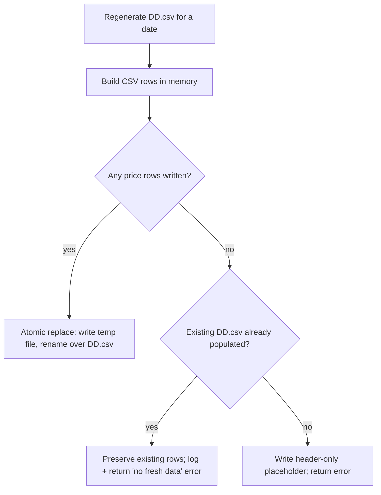

# Durably stop the 2026 market-data CSVs being wiped to a header row

## Summary

The 2026 market-data CSVs under `docs/scores/2026/` kept being reduced to a lone
header row, forcing the dashboard into **"Limited data mode"** for every 2026
date (recurrences #672, #674, #685).

**Root cause — in this repo, not the external pipeline.** The wipe was traced to
this repo's own generator. `src/utils.rs::create_market_data_long_csv` wrote
straight to `File::create(output_path)`, which **truncates the destination CSV
immediately** — *before* the existing "no rows written" guard runs. When the
upstream share-price repository was unavailable for a date, the already-populated
CSV was destroyed and left as a bare header row. The error was returned, but
`src/main.rs` logs per-file errors and continues, so the run still "succeeded"
and the external scorer's `worker/validation.sh` (`model_checkin.sh
GRQ-validation`, default message *"Auto commit models"*) committed the wiped
files straight to `main`.

**Fix — issue Option 2 ("never overwrite a non-empty CSV with a header-only file
when it has no fresh market data").** The writer now builds the CSV in memory and
only touches the destination when it actually has price rows:

- **Rows written → atomic replace.** The new content is staged in a sibling
  temp file and `rename`d over the destination, so a crash mid-write can never
  leave a truncated CSV.
- **Zero rows + existing populated CSV → preserve.** The existing rows are left
  completely untouched; the "no fresh data" error is still returned so the
  upstream gap is visible to the operator.
- **Zero rows + no/empty existing CSV → header-only placeholder** (unchanged
  behaviour for genuinely-new dates), then the same error is surfaced.

This makes the generator non-destructive by construction, so a share-price
outage can no longer wipe committed market data regardless of how the external
pipeline invokes it.

Closes #687.

## Evidence

Backend/CLI change — no web interface to screenshot. Verified via the Rust test
suite and the full local quality gates.

Before this fix the `C -- no` branch always ran `File::create` first, truncating
`DD.csv` to a header row before any check — the wipe.

## Test Plan

New regression tests in `tests/create_market_data_long_csv_test.rs`:

- `create_market_data_long_csv_preserves_existing_rows_when_no_fresh_data` —
  writes a populated CSV, calls the generator with an unavailable ticker (zero
  rows), and asserts the file is byte-for-byte unchanged and an error is still
  returned. **Fails against the pre-fix code** (which truncated it to a header
  row) and passes after the fix.
- `create_market_data_long_csv_replaces_existing_when_fresh_data_available` —
  asserts stale content is fully replaced by fresh data with no leftover
  `.tmp` file (atomic-write path).

Existing tests unchanged and green, including
`create_market_data_long_csv_errors_when_all_tickers_skipped`,
`create_market_data_long_csv_writes_eight_column_rows`, and the
`tests/regression_2026_market_data_test.rs` presence regressions.

Gates run locally: `cargo fmt --check`, `cargo clippy --all-targets`
(+ `--tests`) `-D warnings`, `cargo test --all-targets` (88 lib + all
integration tests pass), `cargo build --release`, `deno test` (1266 passed),
`deno fmt/lint/check`, and `markdownlint-cli2` (0 errors).
