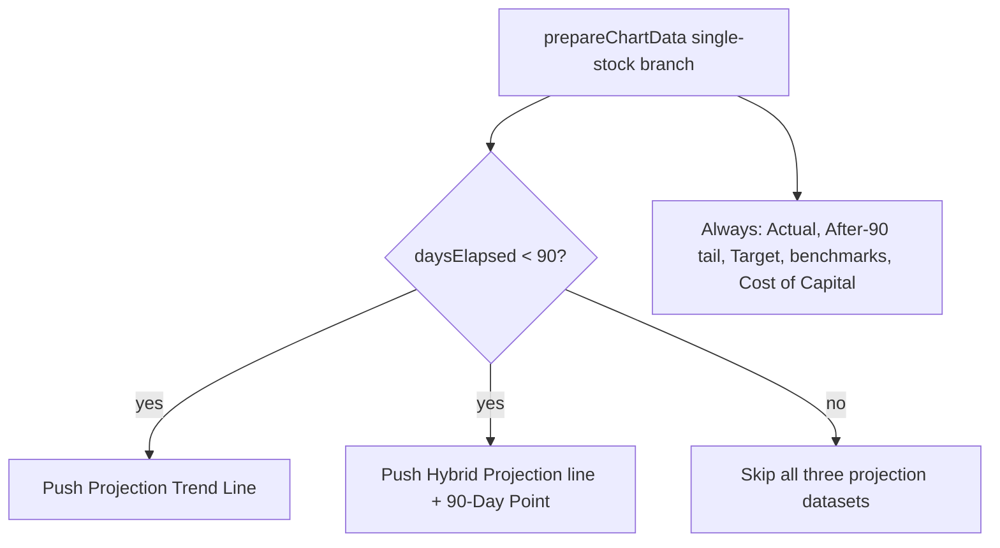

# PR Summary — Issue #688

## Summary

On the single-stock "Stock Performance" chart the projection series exist only
to *estimate* the 90-day outcome before it is known. Once the 90-day window has
elapsed and the real actuals are in, those estimates add noise. This change
hides all three projection datasets once a prediction is **90+ days old**,
leaving just the actuals against the target for a clean actual-vs-target
comparison. While a prediction is **under 90 days old** nothing changes — the
projections stay so the user can gauge how the stock is tracking toward target.

Gated behind a single new pure helper `GRQProjection.shouldShowProjectionLines(daysElapsed)`
(`daysElapsed < 90`) in `docs/projection.js`, wired into the single-stock branch
of `prepareChartData()` in `docs/app.js`:

- **"Projection (Trend Line)"** — green dashed trend: hidden at 90+ days.
- **"Hybrid Projection (…)"** — every variant (purple Target-Based, green
  Upward, red Downward): hidden at 90+ days.
- **"Hybrid 90-Day Point"** — the projected 90-day dot: hidden at 90+ days.

Unchanged in every case: blue "Actual", grey "Actual (After 90 Days)" tail, the
yellow "Target" dot, the benchmark lines (SP500 / NASDAQ / Russell 2000) and the
Cost of Capital line. No scoring or data maths change. The measure of "90+ days"
reuses the branch's existing calendar-day `getDaysElapsed(scoreDate)`.

Closes #688.

## Evidence

Both views captured via headless Chrome against the local dashboard using the
`?date=`/`?stock=` deep links.

**Under 90 days old (2026-06-24, ~7 days) — projections shown:** the purple
dashed "Hybrid Projection (Target-Based)" line runs out to the "Hybrid 90-Day
Point" dot at the 90-day mark.

**90+ days old (2026-03-23, ~100 days) — projections removed:** only actuals
(blue + grey tail), the yellow target dot, the benchmark lines and the cost of
capital line remain; no green trend line, no hybrid projection line, no hybrid
90-day dot.

## Test Plan

Added `tests/projection_line_removal_test.ts` (TDD — written failing first,
passes after the implementation):

- `shouldShowProjectionLines` returns `true` for 0/1/45/89 days and `false` for
  90/91/180/365 days (the day-90 boundary is the target itself).
- Models the single-stock branch's gated pushes: at 45 days all three
  projection series plus Actual + Target are present; at 90 days the three
  projection series are absent while Actual + Target remain.

Full suite: `deno test --allow-read tests/*.ts` → **1270 passed, 0 failed**.
`deno fmt` / `deno lint` / `deno check` clean on the changed files.
