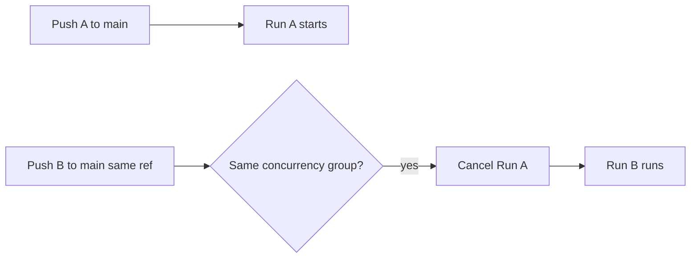

## Summary

Added a top-level `concurrency:` group to `.github/workflows/ci.yml` so that
force-pushes and rapid commits to the same ref cancel any superseded in-flight
run instead of queuing redundant full pipelines. The group is keyed on the
workflow and ref with `cancel-in-progress: true`, so only the latest run for a
given ref survives — saving runner minutes and avoiding races on shared
resources such as the GitHub Pages deployment. Closes #69.

```yaml
concurrency:
  group: ${{ github.workflow }}-${{ github.ref }}
  cancel-in-progress: true
```

## Evidence

This is a CI/configuration change with no web interface to screenshot. It is
verified by the Deno workflow tests in `tests/ci_workflow_test.ts`, which parse
`ci.yml` as YAML and assert on the concurrency block.

Concurrency behaviour the change introduces:



Test run:

```
deno test --allow-read tests/ci_workflow_test.ts
ok | 11 passed | 0 failed
```

## Test Plan

- Added `tests/ci_workflow_test.ts::"CI workflow declares a top-level concurrency group"`
  which fails against the unfixed workflow and passes after the fix. It asserts:
  - a top-level `concurrency` block exists,
  - `group` equals `${{ github.workflow }}-${{ github.ref }}`,
  - `cancel-in-progress` is `true`.
- Full Deno suite re-run: `deno test --allow-read tests/*.ts` → 172 passed, 0 failed.
