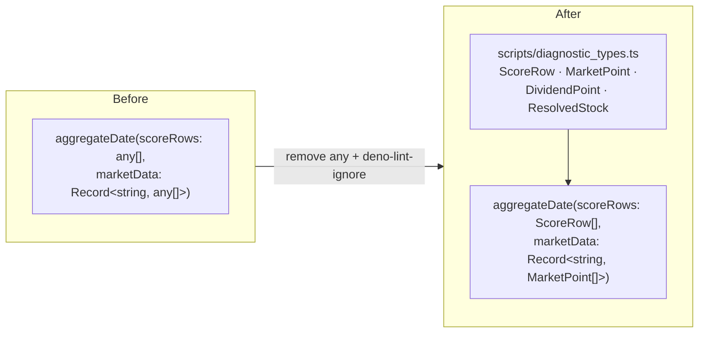

# Replace `any` with shared row interfaces in diagnostic APIs (Issue #692)

## Summary

The exported diagnostic functions across five milestone #544 scripts accepted
`any` / `any[]` / `Record<string, any[]>` for their score, market, dividend and
resolved-stock rows, each guarded by a per-line
`// deno-lint-ignore no-explicit-any`. With `any` at the module boundary the row
shapes were untyped, so property typos (e.g. `stock.buyPrice`) went uncaught at
compile time.

This change defines the row shapes **once** in a new shared module
`scripts/diagnostic_types.ts` and uses them in the exported signatures,
removing the `any` annotations and their `deno-lint-ignore` suppressions. The
rows are locally-parsed CSV/TSV produced by the shipped kernels
(`parseScoreTsv`, `parseMarketCsv`, `parseDividendCsv`,
`resolvePredictionStocks`) — this is a maintainability typing, not a trust
boundary.

`Closes #692.`

### Shared interfaces (`scripts/diagnostic_types.ts`)

- `ScoreRow` — one parsed score-file (TSV) row (`stock` required; parser fields
  the diagnostics never read are optional so synthetic callers may omit them).
- `MarketPoint` — one parsed market-data (CSV) point.
- `DividendPoint` — one `{ exDivDate, amount }` dividend record (shared by the
  in-window map and the trailing-history map).
- `ResolvedStock` — a per-stock projection row from `resolvePredictionStocks`
  (`buyPrice`/`currentPrice` accurately typed `number | null`).

No index signature is used, so a mistyped property name is still a compile
error — the whole point of the change.

### Files updated to consume the interfaces

- `scripts/residual_gap_reconciliation.ts` — `hasUsableTarget(stock)` and
  `aggregateDate(...)`.
- `scripts/buy_price_denominator_diagnostic.ts` — `aggregateDate(...)`.
- `scripts/dividend_basis_diagnostic.ts` — `aggregateDate(...)` (and the local
  `fullHistory` map). Added an explicit `buyPrice === null` narrowing guard: the
  upstream `isStockIncluded` gate already guarantees a positive numeric buy
  price, so the guard narrows `number | null` to `number` for the divisions
  below without changing behaviour (the null branch is unreachable).
- `scripts/horizon_split_parity_diagnostic.ts` — `aggregateDate(...)`.
- `scripts/price_basis_diagnostic.ts` — `aggregateDate(...)`.

The two `const P/TP = (globalThis as any).GRQ*` casts at the top of each file
are a distinct, unavoidable globalThis-access pattern (not a score/market row
signature) and are intentionally left untouched — outside this issue's scope.

## Evidence

Backend/CLI TypeScript change — no web interface to screenshot. Verified via the
Deno quality gates:

- `deno check tests/*.ts scripts/*.ts` — passes (the exported signatures now
  reject a mistyped row and `number | null` is honoured; this is the
  compile-time gate that proves the `any` is gone).
- `deno test --allow-read tests/*.ts` — **1276 passed, 0 failed**, including the
  6 new tests.
- `deno lint` and `deno fmt --check` — clean across `scripts/` and `tests/`.

The Rust crate is untouched by this TypeScript-only change, so the cargo steps
of `quality.sh` are orthogonal.

## Test Plan

New `tests/diagnostic_types_test.ts` (6 tests) constructs **strongly typed**
inputs (`ScoreRow[]`, `Record<string, MarketPoint[]>`, `ResolvedStock`, …) with
**no `as any` casts** and drives each exported signature against the real
shipped kernels, asserting on the computed results:

- `hasUsableTarget` accepts a typed `ResolvedStock` (included / null-target /
  unpriceable cases).
- `aggregateDate` from each of the five scripts accepts the typed row shapes and
  returns the expected aggregate figures.

Existing diagnostic tests
(`residual_gap_reconciliation_test.ts`, `price_basis_diagnostic_test.ts`,
`buy_price_denominator_diagnostic_test.ts`,
`horizon_split_parity_diagnostic_test.ts`,
`dividend_basis_diagnostic_test.ts`) are unchanged and still pass; the
non-consumed parser fields are typed optional precisely so their synthetic
literals continue to compile.
